# GroundedNutriRec Technical Report: Week 1 Foundation and Dataset Exploration

**Framework:** GroundedNutriRec: Retrieval-Augmented Multi-Objective LLM Framework for Health-Aware and Explainable Food Recommendation  
**Report Type:** Academic Technical Paper (Week 1 Review)  
**Authors:** GroundedNutriRec Core Development Team  

---

## 1. Introduction

Food recommendation systems are critical tools in modern digital health, assisting users in discovering recipes that align with their personal taste preferences and nutritional needs. Traditional recommendation models focus primarily on predicting user rating preferences based on historical interaction patterns (collaborative filtering) or recipe descriptions (content-based filtering). However, these systems often neglect nutritional quality, leading to recommendations that may reinforce unhealthy eating habits.

To address this limitation, the GroundedNutriRec framework is designed as a Retrieval-Augmented Multi-Objective Large Language Model (LLM) recommendation system. It integrates user preference learning with dietary guidelines (such as WHO nutritional thresholds) and generates natural language explanations grounded in verified recipe metadata. This report summarizes the Week 1 foundations, focusing on literature review, dataset schemas, and comprehensive exploratory data analysis (EDA) of the Food.com corpus.

---

## 2. Literature and Architectural Review

To build a health-aware and explainable recommendation system, we review five core sub-systems from a computer science perspective:

### 2.1 Collaborative Filtering and Recommendation Baselines
Collaborative filtering (CF) relies on the user-item interaction matrix to identify patterns of shared preferences. In food recommendation, implicit feedback (e.g., whether a user "liked" a recipe based on their rating threshold) is typically preferred over explicit ratings due to the high sparsity of the interaction matrix. Baselines include popularity-based filters, content-based recommendation via TF-IDF or text embeddings, and Matrix Factorization (e.g., Singular Value Decomposition).

### 2.2 Multi-Objective Optimization in Ranking
Ordinary recommender systems maximize a single accuracy metric (e.g., Click-Through Rate or Precision). GroundedNutriRec utilizes multi-objective optimization to balance:
1. User Taste Preference (predicted rating or similarity score)
2. Nutritional Healthiness (WHO dietary density score)
3. Cooking Time / Complexity (as a proxy for user convenience)
4. Recipe Popularity and Novelty

### 2.3 Retrieval-Augmented Generation (RAG) for Explainability
While LLMs can generate persuasive text, they are prone to hallucinations (e.g., fabricating cooking times or claiming a high-sodium recipe is healthy). GroundedNutriRec implements a RAG pipeline that indexes recipe details into a vector database (using FAISS and SentenceTransformer embeddings). The LLM is forced to generate explanations using only the retrieved evidence, ensuring explanations are factually accurate.

### 2.4 Natural Language Inference (NLI) for Faithfulness Verification
To guarantee the reliability of the recommendations, explanations are decomposed into individual claims. A Natural Language Inference (NLI) model assesses whether each claim is logically entailed by the retrieved recipe metadata (the evidence). The faithfulness score is calculated as:
*   Faithfulness = Supported Claims / Total Claims

---

## 3. Dataset Characterization and Schemas

Two primary datasets are explored for the GroundedNutriRec framework: the Food.com dataset (Recipes and Reviews) and the RecipeNLG dataset.

### 3.1 Food.com Dataset
The Food.com dataset is the primary source for interaction history and recipe metadata. It consists of two main tables:
1. **RAW_recipes.csv:** Metadata for 231,637 recipes, including ingredients, preparation steps, preparation time, and a 7-element nutrition vector.
2. **RAW_interactions.csv:** 1,132,367 user reviews and ratings (scale 0-5) spanning from 2000 to 2018.

#### RAW_recipes.csv Schema
| Column Name | Data Type | Description |
|---|---|---|
| name | string | Name of the recipe |
| id | integer | Unique recipe identifier |
| minutes | integer | Preparation and cooking time in minutes |
| contributor_id | integer | User identifier of the recipe contributor |
| submitted | date | Date the recipe was submitted |
| tags | list (string) | Categories and tags associated with the recipe |
| nutrition | list (float) | 7-element vector: [calories (kcal), total fat (PDV), sugar (PDV), sodium (PDV), protein (PDV), saturated fat (PDV), carbohydrates (PDV)] |
| n_steps | integer | Number of steps in the preparation |
| steps | list (string) | Detailed text steps |
| description | string | Text description of the recipe |
| ingredients | list (string) | List of ingredient names |
| n_ingredients | integer | Number of ingredients |

#### RAW_interactions.csv Schema
| Column Name | Data Type | Description |
|---|---|---|
| user_id | integer | Unique user identifier |
| recipe_id | integer | Unique recipe identifier |
| date | date | Date of the interaction |
| rating | integer | User rating (0-5, where 0 indicates no explicit rating) |
| review | string | User review text |

### 3.2 RecipeNLG Dataset
The RecipeNLG dataset contains 1,016,801 recipes and is primarily used to augment text-based generation and Named Entity Recognition (NER) tasks. It contains recipe titles, ingredients, and steps, but lacks user interaction logs, making it suitable for content-based indexing and language model fine-tuning rather than collaborative preference modeling.

---

## 4. Exploratory Data Analysis (EDA)

A comprehensive exploratory data analysis was conducted on the Food.com corpus to characterize distributions, identify outliers, and evaluate sparsity. Below are the key findings and visualizations.

### 4.1 Cooking Time, Steps, and Ingredients Distributions
Extreme outlier values were observed in the raw cooking time data, with some recipes reporting preparation times exceeding millions of minutes. A cooking time threshold of 1,440 minutes (24 hours) was applied to remove these outliers, retaining 229,637 recipes (99.14% of the corpus). The median number of ingredients per recipe is 9 (range 1-43), and the median number of steps is 9 (range 0-145).

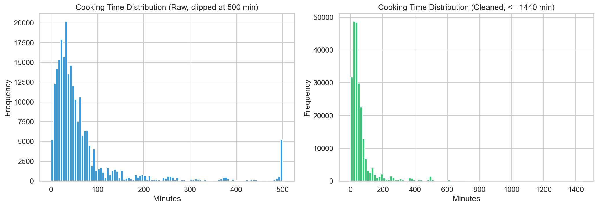
*Figure 1: Comparison of cooking time distributions before and after outlier removal.*

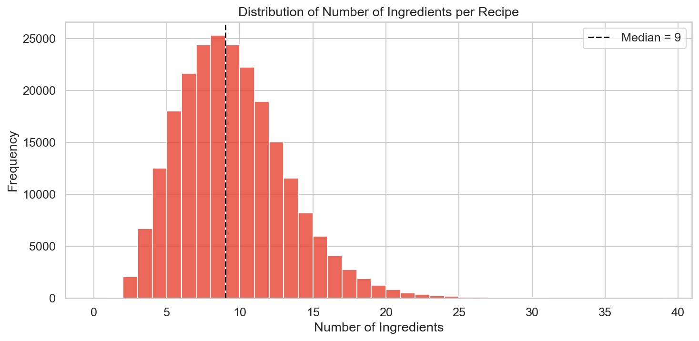
*Figure 2: Distribution of the number of ingredients per recipe.*

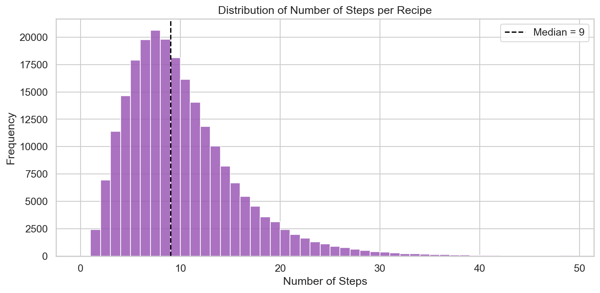
*Figure 3: Distribution of the number of steps per recipe.*

### 4.2 Nutrition Vector Analysis
The 7-element nutrition vector represents percent Daily Value (% PDV) based on a 2000 kcal diet (except calories, which is in kcal). Boxplots of these values show significant right-skew, indicating a substantial number of high-fat, high-sugar, or high-sodium recipes. Correlation analysis indicates a strong positive correlation between total fat and saturated fat (0.83) and a moderate correlation between total fat and calories (0.69).

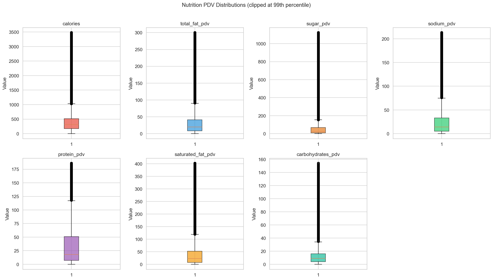
*Figure 4: Nutrition PDV distributions (clipped at the 99th percentile for visibility).*

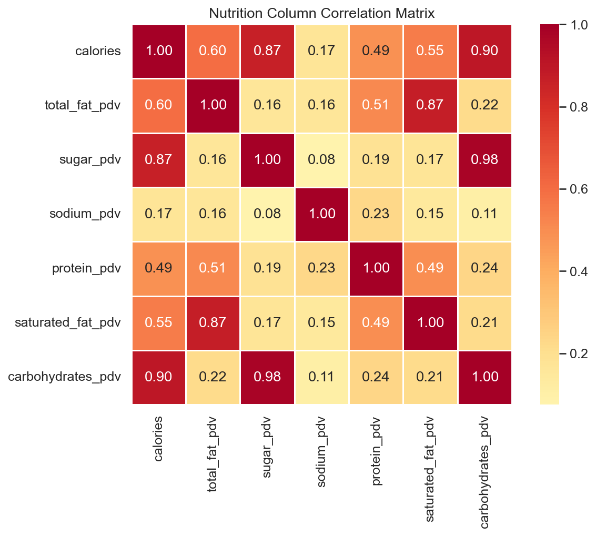
*Figure 5: Pearson correlation coefficients between the 7 nutrition columns.*

### 4.3 Interaction Skew, Activity, and Matrix Sparsity
The rating distribution is highly skewed towards positive ratings, with 5-star ratings accounting for over 70% of all interactions. Ratings of 0 represent reviews without explicit scores, which are treated as missing in explicit rating models or mapped to null in implicit feedback models.

The interaction matrix is extremely sparse:
*   Unique Users: 226,570
*   Unique Recipes: 231,637
*   Total Interactions: 1,132,367
*   Matrix Sparsity: **99.99784%**

This extreme sparsity represents a severe challenge for collaborative filtering, necessitating k-core filtering or matrix factorization to stabilize recommender baselines. Furthermore, user activity and recipe popularity follow power-law distributions, with 166,256 users (73.38%) having only 1 interaction in the history.

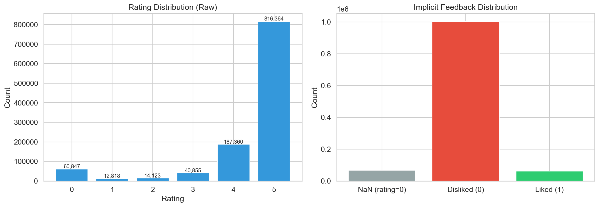
*Figure 6: Raw rating distribution (left) and implicit feedback mapping (right).*

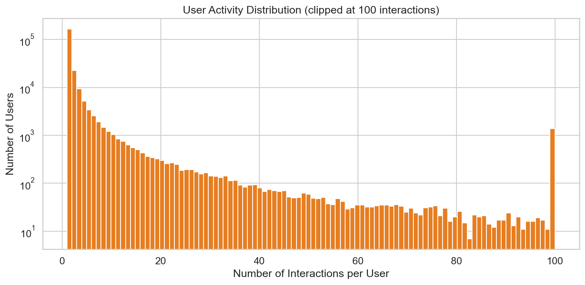
*Figure 7: Distribution of interactions per user on a logarithmic scale.*

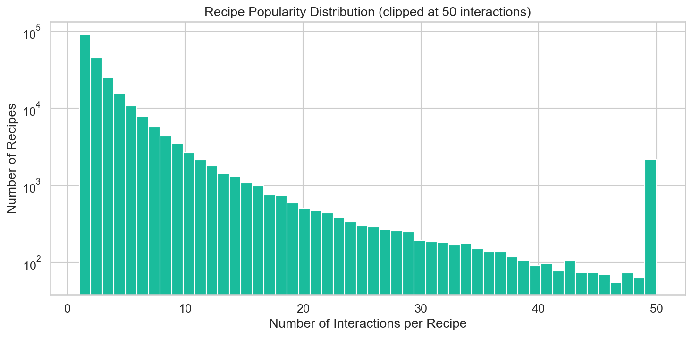
*Figure 8: Distribution of interactions per recipe on a logarithmic scale.*

### 4.4 Temporal and Vocabulary Patterns
User interactions and recipe submissions span from 2000 to 2018, with submissions peaking in 2008 and user interactions peaking in 2008-2012. Tag frequency analysis reveals that "preparation", "time-to-make", and "course" are the most frequent recipe tags. The most common ingredients in the corpus are salt (appearing in 85,090 recipes), butter (54,741), and sugar (43,974).

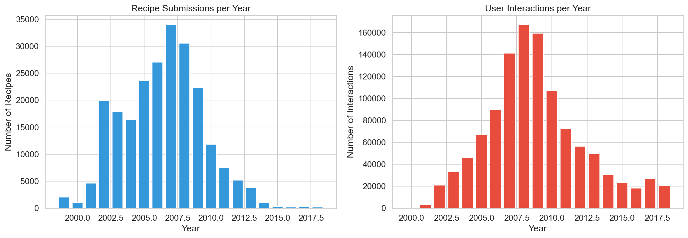
*Figure 9: Recipe submissions (left) and user interactions (right) per year.*

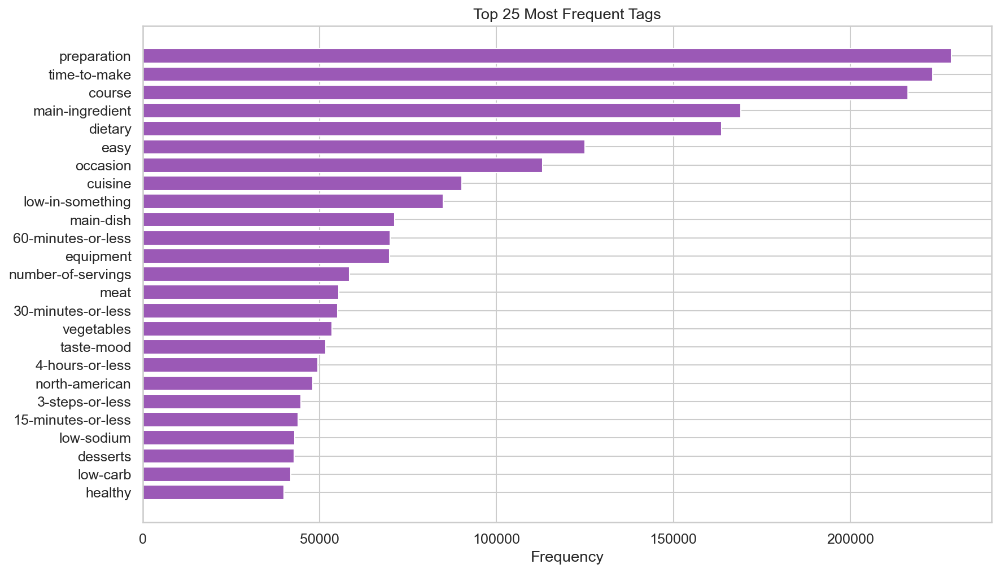
*Figure 10: Most frequent recipe tags in the Food.com dataset.*

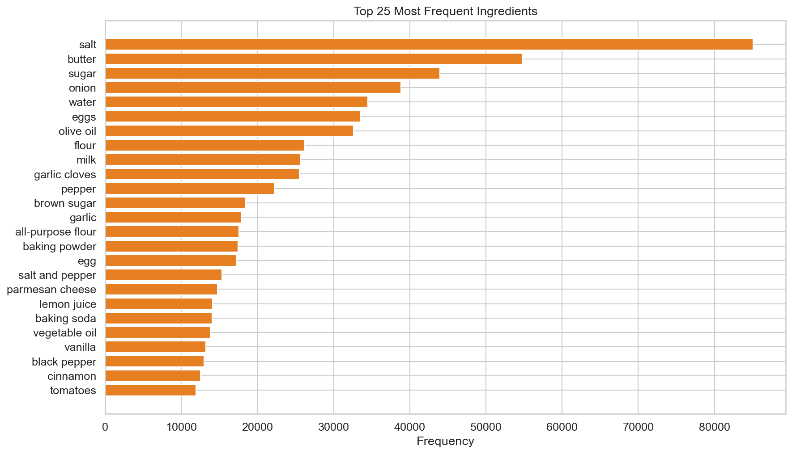
*Figure 11: Most frequent ingredients in the Food.com dataset.*

---

## 5. Description of the Food.com Dataset
Following formal description guidelines, we characterize the dataset below:

### 5.1 Brief Introduction
The Food.com dataset is a public repository of recipe metadata and user reviews collected from the Food.com website, widely used in research for personalized food recommendation, sentiment analysis, and text-based recipe generation.

### 5.2 Detailed Explanation
The dataset contains structured recipes containing cooking steps, ingredient lists, and nutrient breakdowns, alongside user-wise review texts, submission timestamps, and ratings. The data spans a 18-year period, capturing evolving culinary trends and user interaction habits.

### 5.3 Examples
A typical entry in `RAW_recipes.csv` is "chicken lickin good pork chops" (ID 63986), which lists ingredients like pork chops, cream of chicken soup, and brown sugar, with 20 minutes of cooking time, 5 steps, and a nutritional breakdown of 289 kcal, 22% PDV fat, 14% PDV sugar, and 23% PDV protein.

### 5.4 Advantages
- **Scale:** Offers over 1.1 million interactions and 230,000 recipes, making it one of the largest public food recommendation datasets.
- **Rich Context:** Includes text reviews, nutrition breakdowns, and preparation steps, enabling content-based, collaborative, and hybrid recommender designs.

### 5.5 Disadvantages
- **Extreme Sparsity:** Matrix sparsity exceeds 99.99%, causing difficulty for collaborative filtering models.
- **Outliers:** Contains erroneous data entries (e.g., millions of minutes cooking time) that require rigorous cleaning.

### 5.6 Use Cases
- Collaborative filtering for recipe recommendation.
- Health-aware recommendation via multi-objective ranking.
- Retrieval-augmented explanation generation using recipe metadata.

### 5.7 Limitations
- Cannot be used directly for real-time recommendation without significant k-core filtering to stabilize sparse profiles.
- The dataset represents a historical snapshot (2000-2018) and does not capture post-2018 culinary trends or current user dietary shifts.
