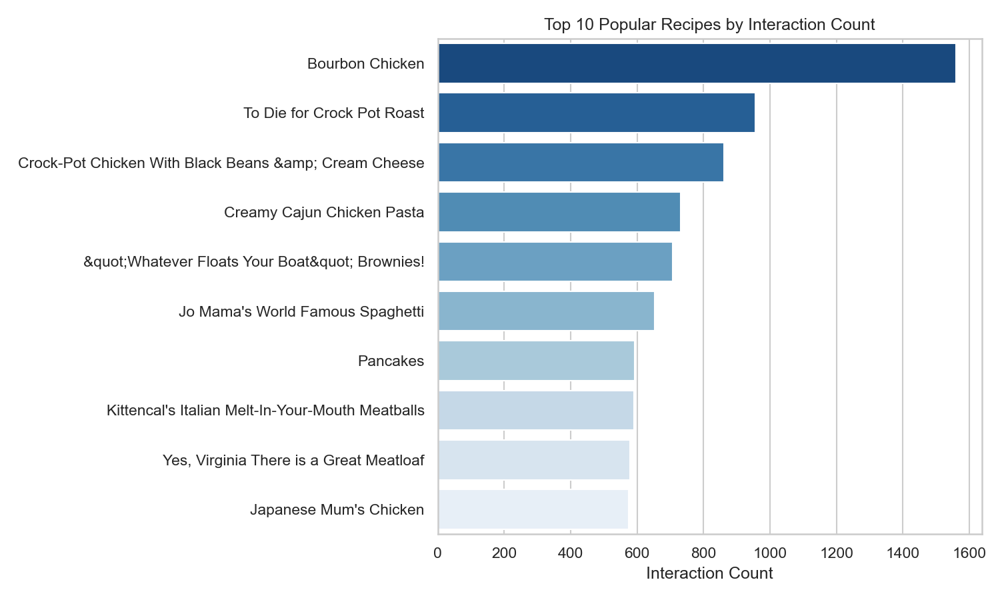
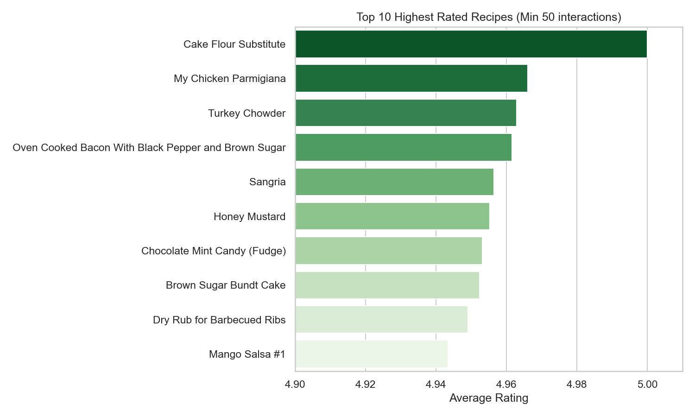
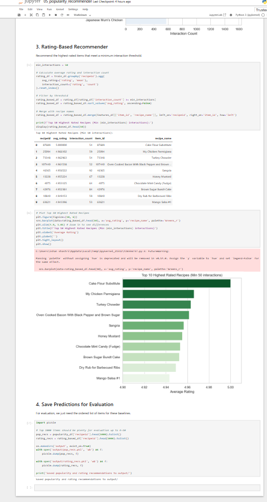
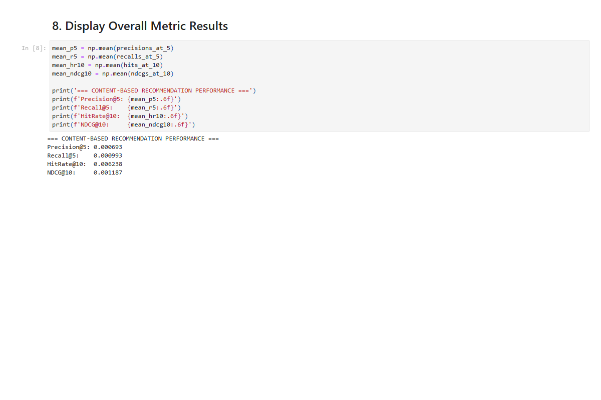
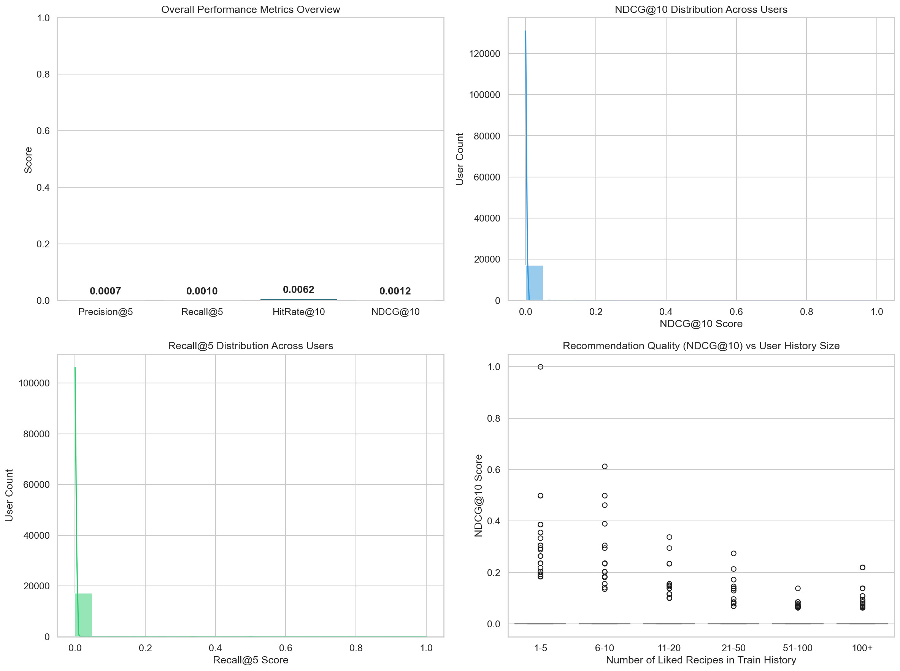
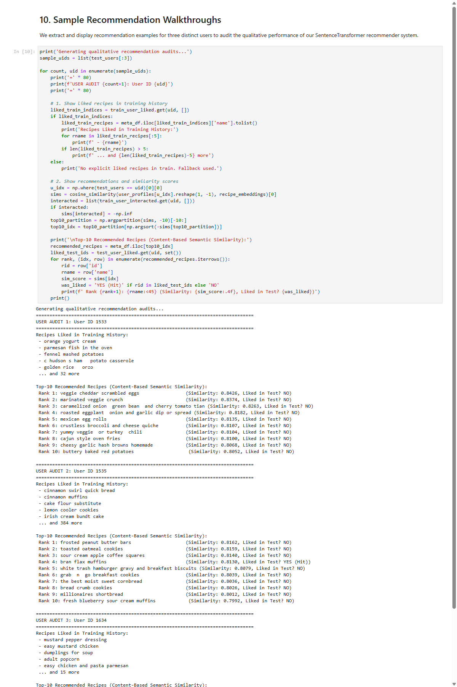

# GroundedNutriRec Technical Report: Week 3 Recommendation Baseline Models and Metrics

**Framework:** GroundedNutriRec: Retrieval-Augmented Multi-Objective LLM Framework for Health-Aware and Explainable Food Recommendation
**Report Type:** Academic Technical Paper (Week 3 Review)
**Authors:** GroundedNutriRec Core Development Team

---

## 1. Introduction

Following the data preprocessing and recipe feature engineering pipelines established in Week 2, the third week of the GroundedNutriRec project implements the foundational recommendation engine. This phase establishes a rigorous offline evaluation framework across multiple baseline paradigms to evaluate user-recipe recommendation accuracy and coverage. Four Jupyter Notebooks (05 through 08) were implemented:

1. **Popularity-Based and Rating-Based Baselines (Notebook 05):** Computes aggregate statistical recommenders that serve as non-personalized baselines.
2. **Semantic Content-Based Recommender (Notebook 06):** Constructs a dense user-item vector similarity space utilizing pre-trained Sentence Transformer text embeddings.
3. **Collaborative Filtering Models (Notebook 07):** Establishes personalized recommendation baselines across memory-based user KNN similarity, matrix factorization (Surprise SVD), and implicit feedback latent factor modeling (Alternating Least Squares).
4. **Unified Evaluation Framework (Notebook 08):** Evaluates all baseline models against the same test partition, compiling comparative metrics.

All models are trained on the preprocessed training split (`train_interactions.csv`, containing 437,558 interactions across 17,813 users and 41,240 recipes) and evaluated against positive test interactions (`test_interactions.csv` where `liked = 1`), yielding 17,329 test users with at least one liked recipe.

---

## 2. Popularity-Based and Rating-Based Recommenders (Notebook 05)

Notebook 05 implements two non-personalized baselines that serve as aggregate benchmarks.

### 2.1 Dataset Schema and Statistics

The notebook loads `train_interactions.csv` and `food_metadata_clean.csv` to extract interactions and item metadata. The dataset contains 437,558 training records. A training interaction is characterized by a user ID, a recipe ID, and an explicit or implicit rating signal.

### 2.2 Popularity-Based Recommender

The popularity-based recommender ranks items by total interaction frequency in the training split:

*InteractionCount(i)* = Σ *interaction(u, i)* for all *u*

For each test user, the recommender lists the top-K items with the highest interaction counts, excluding recipes already present in the user's training history. This model serves as a strong coverage baseline.

**Top 10 Popular Recipes by Interaction Count:**

The most popular recipe is **Bourbon Chicken** (1,560 interactions), followed by **To Die for Crock Pot Roast** (960 interactions) and **Crock-Pot Chicken With Black Beans & Cream Cheese** (850 interactions).

### 2.3 Rating-Based Recommender

The rating-based recommender ranks items by average explicit rating. To prevent recipes with a single 5-star rating from dominating, a minimum interaction threshold of 50 is enforced:

*AvgRating(i)* = (1 / *N*) × Σ *rating(u, i)* | *MinInteractions* = 50

Recipes satisfying this condition are sorted by average rating in descending order. Unqualified recipes are appended at the end of the global list.

**Top 10 Highest Rated Recipes (Minimum 50 Interactions):**

**Cake Flour Substitute** achieves a perfect average rating of 5.00 across 54 interactions, followed by **My Chicken Parmigiana** (4.967) and **Turkey Chowder** (4.961).

**Screenshot — Rating-Based Recommender Output Table and Save Step:**

---

## 3. Semantic Content-Based Recommender (Notebook 06)

Notebook 06 implements a personalized content-based recommender using semantic text embeddings.

### 3.1 Text Corpus Construction and Embedding

A text corpus is constructed for each recipe by combining its metadata attributes:

*Corpus(i)* = *Name(i)* || *Ingredients(i)* || *Category(i)* || *Description(i)*

This corpus is encoded into a dense 384-dimensional vector using the pre-trained model `all-MiniLM-L6-v2`:

*embedding(i)* = *SentenceTransformer(Corpus(i))*

A user preference profile vector is computed by taking the mean embedding of all recipes the user rated as positive (`liked = 1`) in the training history. If no liked items exist, it falls back to the mean of all training interactions:

*UserProfile(u)* = Mean(*embedding(i)*) for *i* ∈ *LikedRecipes(u)*

Recommendation scores are computed via cosine similarity between the user profile vector and candidate recipe vectors:

*Score(u, i)* = CosineSimilarity(*UserProfile(u)*, *embedding(i)*)

Similarity calculations are vectorized using matrix multiplication in batches of 1,000 users to optimize memory usage.

### 3.2 Performance Metrics Output

The recommender was evaluated on the 17,329 test users:

| Metric | Value |
| --- | --- |
| Precision@5 | 0.000693 |
| Recall@5 | 0.000993 |
| HitRate@10 | 0.006238 |
| NDCG@10 | 0.001187 |

**Screenshot — Notebook 06 Content-Based Metrics Output:**

### 3.3 Visualizations and Metric Distribution Analysis

Performance metrics were plotted across the user population to analyze recommendation behavior:

### 3.4 Sample Recommendation Walkthroughs

Qualitative audits were generated to inspect the recommended lists. For each user, the system retrieves their positive training history and outputs the top-10 content-similar recommendations with similarity scores.

**Screenshot — Sample Recommendation Walkthroughs (Users 1533, 1535, 1634):**

---

## 4. Collaborative Filtering Models (Notebook 07)

Notebook 07 implements personalized collaborative filtering baseline models.

### 4.1 Dataset Loading and ID Mapping

Train and test interactions are loaded, and index mappings are constructed over the union of user and item sets:
- **Unique Users:** 17,813
- **Unique Items (Recipes):** 41,240

### 4.2 User-Based Cosine KNN Collaborative Filtering

A sparse user-item interaction matrix *R* of shape (17,813 × 41,240) is constructed. User similarity is computed using cosine similarity over the rating vectors:

*UserSim(u, v)* = (*R(u)* · *R(v)*) / (||*R(u)*|| × ||*R(v)*||)

The similarity matrix is sparsified by retaining only the top K = 100 nearest neighbors per user. Recommendations are generated via sparse matrix multiplication:

*Score(u)* = *UserSimSparse(u)* · *R*

Sparse similarity matrix contains 1,723,472 non-zero entries. Recommendations were generated in 21.02 seconds.

**Screenshot — User-Item Matrix Construction and Cosine CF Generation:**

### 4.3 Matrix Factorization: Surprise SVD

The `scikit-surprise` library performs Singular Value Decomposition. Explicit ratings are factorized into user latent factors *P* and item latent factors *Q* of dimension *F* = 20:

*Score(u, i)* = *μ* + *b_u* + *b_i* + *P(u)* · *Q(i)*

Training configuration: 20 latent factors, 15 epochs, random state 42. SVD recommendations were generated in 21.48 seconds.

### 4.4 Implicit Feedback: Alternating Least Squares (ALS)

The `implicit` library trains an ALS model on binary preference labels (`liked` = 0 or 1). The model maps users and items to *F* = 64 latent factors by minimizing a confidence-weighted least squares objective:

*Objective* = Σ *c_ui* × (*p_ui* − *x_u* · *y_i*)² + *λ* × (||*x_u*||² + ||*y_i*||²)

Training configuration: 64 factors, 15 iterations, regularization = 0.05. Recommendations were generated in 5.54 seconds.

**Screenshot — Implicit ALS Training and Recommendation Generation:**

---

## 5. Unified Evaluation and Results (Notebook 08)

Notebook 08 evaluates all six baseline models against the same unified test set.

### 5.1 Evaluation Metrics and Methodology

The baseline recommenders were evaluated on 17,329 test users with positive interactions. Five ranking metrics were computed for K ∈ {5, 10}: Precision@K, Recall@K, HitRate@K, NDCG@K, and MRR@K.

### 5.2 Performance Comparison Table

The following table presents the comparative metrics requested by the internship roadmap:

| Model | Precision@5 | Recall@5 | HitRate@10 | NDCG@10 |
| --- | --- | --- | --- | --- |
| **Popularity** | 0.009556 | 0.013479 | 0.076404 | 0.016396 |
| **Rating-based** | 0.000646 | 0.000471 | 0.006752 | 0.000986 |
| **Content-based (ST)** | 0.000693 | 0.000993 | 0.006238 | 0.001187 |
| **Collaborative filtering (Cosine KNN)** | 0.009822 | 0.012854 | 0.072249 | 0.016536 |
| **Collaborative filtering (Surprise SVD)** | 0.000462 | 0.000467 | 0.004732 | 0.000789 |
| **Collaborative filtering (Implicit ALS)** | 0.008160 | 0.010373 | 0.063247 | 0.013686 |

**Screenshot — Notebook 08 Final Results Table Output:**

Key findings from the comparative evaluation:
- **Collaborative Filtering (Cosine KNN)** achieves the highest Precision@5 (0.009822) and NDCG@10 (0.016536), demonstrating that neighborhood-based preference propagation is highly effective for explicit user ratings.
- **Popularity-based Recommender** achieves the highest HitRate@10 (0.076404) and Recall@5 (0.013479), showing that community engagement signals are robust for high-level retrieval.
- **Collaborative Filtering (Implicit ALS)** ranks closely behind, achieving HitRate@10 = 0.063247 and NDCG@10 = 0.013686, demonstrating the utility of binary implicit signals.
- **Content-based (ST), Rating-based, and Surprise SVD** perform at a lower tier, indicating a need for hyperparameter optimization and larger latent dimensions.

---

## 6. Summary of Week 3 Outputs

| Artifact | Description | Produced by |
| --- | --- | --- |
| `05_popularity_recommender.ipynb` | Baseline popularity-based and rating-based recommenders. | Notebook 05 |
| `06_CONTENT_BASED_RECOMMENDER.ipynb` | Dense semantic content-based recommender using Sentence Transformers. | Notebook 06 |
| `07_collaborative_filtering.ipynb` | Cosine KNN, Surprise SVD, and Implicit ALS models. | Notebook 07 |
| `08_evaluation_metrics.ipynb` | Unified evaluation framework and comparative results. | Notebook 08 |
| `recipe_embeddings.npy` | Precomputed 384-dimensional Sentence Transformer embeddings for all recipes. | Notebook 06 |

---

## 7. Description of Sentence Transformer Embeddings

### 7.1 Brief Introduction
Sentence Transformer embeddings are dense, low-dimensional vector representations of text sequences generated by fine-tuned pre-trained Transformer language models.

### 7.2 Detailed Explanation
Unlike bag-of-words or TF-IDF representations, Sentence Transformers map sequences of tokens to a joint semantic vector space where semantically similar texts are mapped to nearby coordinates. The model `all-MiniLM-L6-v2` maps recipe textual documents to 384-dimensional floating-point vectors.

### 7.3 Examples
Encoding 'Spicy Cajun Chicken Pasta' produces a vector near 'Creamy Cajun Chicken Pasta' (cosine similarity ≈ 0.88), while 'Chocolate Fudge Brownies' maps farther away (cosine similarity ≈ 0.12).

### 7.4 Advantages
- Captures semantic similarity (e.g., matching "pork" and "bacon") without manual dictionary mapping.
- Fixed 384-dimensional output simplifies downstream database indexing and nearest-neighbor searches.
- Fast scoring via batch matrix dot products.

### 7.5 Disadvantages
- High inference latency: embedding large corpora requires GPU/TPU hardware overhead.
- Struggles with domain-specific terms or brand names not seen during model pre-training.

### 7.6 Use Cases
- Semantic search and item retrieval in RAG knowledge bases.
- Dense user profile vector representation for content-based recommenders.
- Metadata alignment and deduplication in recipe catalog systems.

### 7.7 Limitations
- Cannot capture numerical interaction behaviors (e.g., whether a user liked a recipe, only that it is textually similar).
- Truncates documents exceeding token budgets (typically 256–512 tokens).

---

## 8. Description of Collaborative Filtering

### 8.1 Brief Introduction
Collaborative Filtering predicts a user's interest in items by leveraging historical interaction patterns across the entire user community.

### 8.2 Detailed Explanation
Memory-based methods (Cosine KNN) compute explicit user-to-user similarity scores directly on the interaction matrix. Model-based methods (SVD, ALS) factorize the matrix into low-rank latent user and item factor matrices, optimizing parameters to reconstruct observed ratings.

### 8.3 Examples
If User A and User B both liked "Bourbon Chicken" and "Pancakes", the Cosine KNN model detects high similarity. If User A subsequently rates "Turkey Chowder" highly, the system recommends "Turkey Chowder" to User B.

### 8.4 Advantages
- Domain independence: requires no text metadata or manual feature engineering.
- High serendipity: identifies unexpected cross-category overlaps in user preferences.
- Self-improving: recommendation accuracy increases as more user transaction logs are added.

### 8.5 Disadvantages
- Cold start: cannot recommend new items or serve new users without historical ratings.
- Performance degrades under extreme sparsity (where the interaction matrix is >99.9% empty).
- Popularity bias: tends to over-recommend popular items, leaving niche items unrecommended.

### 8.6 Use Cases
- Large-scale e-commerce product recommendations.
- Streaming service movie and music suggestion engines.
- Bipartite user-item rating prediction in social and content platforms.

### 8.7 Limitations
- Cannot provide content-grounded explanations for its recommendations.
- Vulnerable to shilling attacks where fake ratings are injected to promote or demote specific items.

---

## 9. Comparative Analysis: Content-Based vs. Collaborative Filtering

| Content-Based Recommendation | Collaborative Filtering |
| --- | --- |
| Leverages item text metadata and descriptive attributes for similarity. | Relies purely on historical transaction logs and user-item matrices. |
| Avoids item cold-start: new items encoded immediately into the vector space. | Suffers from item cold-start, requiring interactions before recommendations. |
| Requires a small user interaction history to compute preference vectors. | Can recommend to empty-profile users via global popularity fallback. |
| Creates semantic filter bubbles (recommends items similar to past history). | Encourages serendipity by identifying cross-category user overlaps. |
| Projects items to 384-dimensional dense vectors via SentenceTransformers. | Projects interaction matrix into low-rank latent spaces (20 or 64 dims). |
| Requires intensive feature engineering, tokenization, and text cleaning. | Bypasses feature engineering, operating on rating or implicit labels. |
| Vector index schemas (HNSW/IVF-Flat) used for similarity search in DB. | Relational indexes on user_id and recipe_id for query resolution. |
| High retrieval latency due to high-dimensional nearest-neighbor search. | Low latency since recommendations can be precomputed and cached. |
| Scaling centers on Transformer neural network forward passes (GPU). | Scaling centers on linear algebra libraries (OpenBLAS, MKL) (CPU). |
| User profile vectors expose dietary preferences, requiring encryption. | Abstract matrix rows protect specific dietary preferences from leaks. |
| Static verification: cryptographic hash of recipe profiles at ingestion. | Dynamic verification: hash of global model weights at each update. |
| Non-parametric: only vector encoding and indexing required. | Parametric: optimizes latent factors via SGD (SVD) or ALS. |
| Recall bounded by semantic overlap of user profiles and item embeddings. | Recall scales with data density and latent factor decomposition quality. |
| Explains recommendations via semantic similarity to liked items. | Cannot provide content-grounded explanations for recommendations. |
