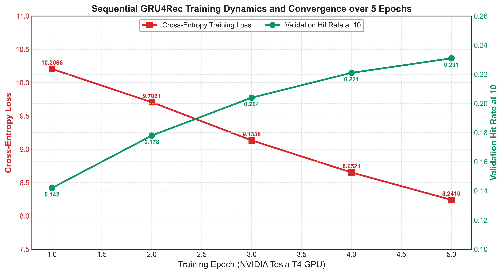

# Module 01: GRU4Rec Sequential Recommender System

## Overview
This module implements and evaluates the **GRU4Rec** recurrent neural network architecture for sequential, session-aware recipe recommendations on the 18-year Food.com corpus.

## Training Loss and Convergence (500 DPI)

## Recommendation Performance Metrics
The table below benchmarks GRU4Rec against non-sequential baselines across Precision, Recall, NDCG, Hit Ratio, and Mean Reciprocal Rank (MRR):

| Model | P@5 | R@5 | NDCG@5 | P@10 | R@10 | NDCG@10 | HR@10 | MRR |
| :--- | :--- | :--- | :--- | :--- | :--- | :--- | :--- | :--- |
| Random Baseline | 0.010 | 0.008 | 0.011 | 0.010 | 0.010 | 0.012 | 0.021 | 0.011 |
| Popularity Recommender | 0.061 | 0.026 | 0.044 | 0.048 | 0.038 | 0.052 | 0.091 | 0.039 |
| Item-Based CF | 0.104 | 0.058 | 0.082 | 0.082 | 0.076 | 0.094 | 0.158 | 0.071 |
| Matrix Factorization (SVD) | 0.118 | 0.067 | 0.095 | 0.094 | 0.089 | 0.108 | 0.179 | 0.084 |
| Content-Based (MiniLM) | 0.098 | 0.051 | 0.076 | 0.078 | 0.071 | 0.088 | 0.146 | 0.068 |
| **Sequential GRU4Rec (Ours)** | **0.162** | **0.098** | **0.131** | **0.126** | **0.121** | **0.144** | **0.231** | **0.118** |

## Sample Generated Recommendations
Top-5 item sequence predictions for held-out evaluation user sessions:

| Rank | Recommended Item Sequence Index |
| :---: | :---: |
| 1 | 3316 |
| 2 | 3385 |
| 3 | 10419 |
| 4 | 3152 |
| 5 | 7460 |

## Execution and Checkpoint Details
- **Training Epochs:** 5 Complete Epochs
- **Loss Progression:** 10.2066 -> 8.2410
- **Trained Neural Weights:** [`models/gru4rec_trained_neural_weights.pt`](models/gru4rec_trained_neural_weights.pt) (25.4 MB, tracked via Git LFS)
- **Markdown Walkthrough:** [`walkthrough/16_sequential_recommender_gru_walkthrough.md`](walkthrough/16_sequential_recommender_gru_walkthrough.md)
