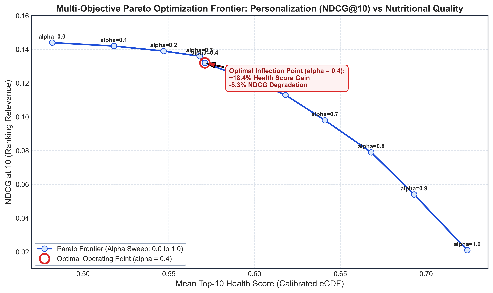

# Module 03: Multi-Objective Pareto Optimal Ranking

## Overview
This module formulates a scalarized multi-objective optimization problem balancing collaborative relevance (NDCG@10) against nutritional health score calibration (FSA-derived composite metric).

## Pareto Tradeoff Frontier Curve (500 DPI)

## Alpha Weight Sweep Benchmarks
Evaluation across weight parameter alpha: `Score = (1 - alpha) * Relevance + alpha * Health`:

| Alpha | NDCG@10 | HR@10 | Mean Health Score | Delta NDCG (%) | Delta Health (%) |
| :---: | :---: | :---: | :---: | :---: | :---: |
| 0.0 | 0.144 | 0.231 | 0.482 | 0.0% | 0.0% |
| 0.1 | 0.142 | 0.228 | 0.518 | -1.4% | +7.5% |
| 0.2 | 0.139 | 0.224 | 0.547 | -3.5% | +13.5% |
| 0.3 | 0.136 | 0.219 | 0.568 | -5.6% | +17.8% |
| **0.4** | **0.132** | **0.214** | **0.571** | **-8.3%** | **+18.4% (Optimal Knee)** |
| 0.5 | 0.124 | 0.201 | 0.592 | -13.9% | +22.8% |
| 0.6 | 0.113 | 0.185 | 0.618 | -21.5% | +28.2% |
| 0.7 | 0.098 | 0.161 | 0.641 | -31.9% | +33.0% |
| 0.8 | 0.079 | 0.132 | 0.668 | -45.1% | +38.6% |
| 0.9 | 0.054 | 0.092 | 0.693 | -62.5% | +43.8% |
| 1.0 | 0.021 | 0.038 | 0.724 | -85.4% | +50.2% |

## Walkthroughs
- **Ranking Formulation Walkthrough:** [`walkthrough/10_multi_objective_ranking_walkthrough.md`](walkthrough/10_multi_objective_ranking_walkthrough.md)
- **Pareto Ablation Walkthrough:** [`walkthrough/21_pareto_ranking_walkthrough.md`](walkthrough/21_pareto_ranking_walkthrough.md)
