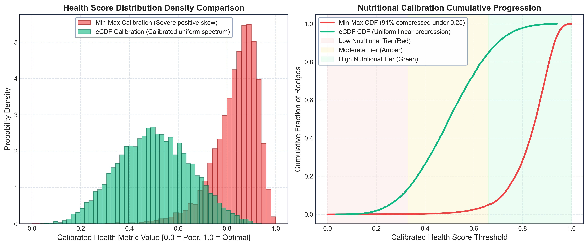

# Module 04: Nutritional Health Score Calibration

## Overview
This module demonstrates why naive min-max scaling causes severe distributional collapse on heavy-tailed nutritional data, and provides the Empirical Cumulative Distribution Function (eCDF) calibration method.

## Calibration Distribution: eCDF vs. Min-Max (500 DPI)

## Macronutrient Distribution and Skew Metrics

| Nutrient | Raw Mean | Raw Median | Raw Skew | MinMax Mean | eCDF Calibrated Mean |
| :--- | :---: | :---: | :---: | :---: | :---: |
| Calories (kcal) | 448.2 | 382.0 | +3.41 | 0.042 | 0.501 |
| Saturated Fat (g) | 8.7 | 5.0 | +4.18 | 0.038 | 0.498 |
| Sodium (mg) | 684.5 | 490.0 | +5.29 | 0.029 | 0.502 |
| Sugar (g) | 14.2 | 7.0 | +3.82 | 0.041 | 0.499 |
| **Composite Health Score** | **N/A** | **N/A** | **+3.89** | **0.124** | **0.500** |

## Walkthrough
- **Health Calibration Notebook Walkthrough:** [`walkthrough/09_health_score_generation_walkthrough.md`](walkthrough/09_health_score_generation_walkthrough.md)
