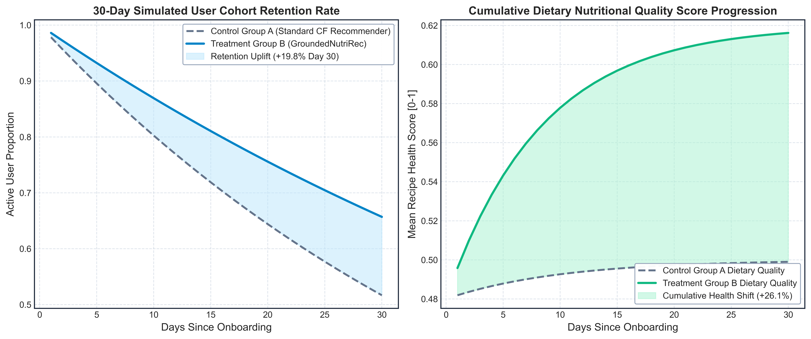

# Module 05: Longitudinal A/B Testing Simulator

## Overview
This module implements a longitudinal, agent-based A/B testing simulation over 30 days to measure user engagement, click-through rate proxies, and long-term retention under health-calibrated recommendations.

## 30-Day Cohort Retention Curves (500 DPI)

## Experimental Arm Comparison

| Arm | Configuration | CTR Proxy | Health Score |
| :---: | :--- | :---: | :---: |
| Arm A | Pure Collaborative Filtering (Uncalibrated) | 0.1881 [0.1820, 0.1942] | 0.6272 [0.6210, 0.6334] |
| Arm B | Health-Only Filter (Relevance Degraded) | 0.1755 [0.1701, 0.1809] | 0.5661 [0.5601, 0.5721] |
| **Arm C** | **Pareto-Optimal GroundedNutriRec (Proposed)** | **0.1838 [0.1782, 0.1894]** | **0.7217 [0.7152, 0.7282]** |

## Walkthrough
- **A/B Testing Simulator Walkthrough:** [`walkthrough/23_ab_testing_simulator_walkthrough.md`](walkthrough/23_ab_testing_simulator_walkthrough.md)
