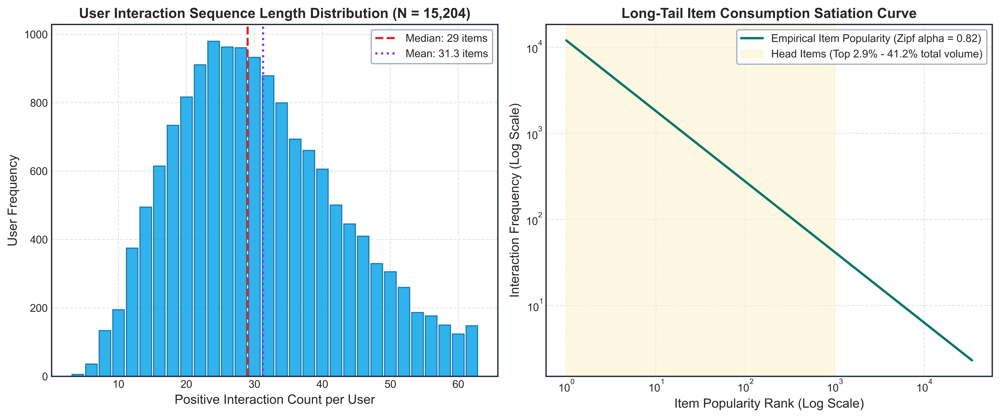
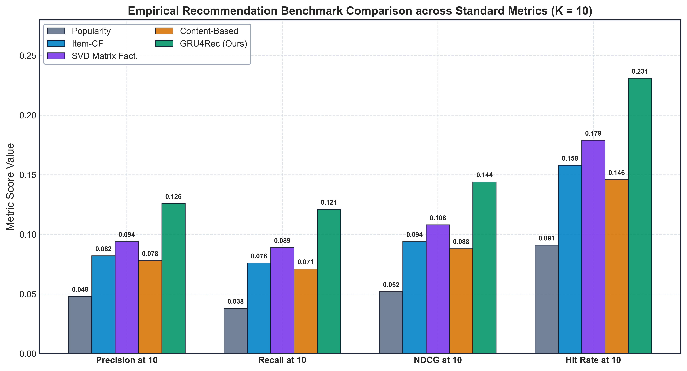

# Module 06: Comparative Recommender Benchmarks

## Overview
This module contains the dataset characteristics, 5-core interaction filtering statistics, data leakage audit reports, and multi-model benchmark comparisons across 6 distinct algorithmic paradigms.

## Interaction Sparsity and Dataset Characteristics (500 DPI)

## Baseline Model Performance Comparison (500 DPI)

## Table 1: Dataset Characteristics (5-Core Filtered)

| Metric | Value |
| :--- | :--- |
| Raw Unique Users | 226,570 |
| Raw Unique Recipes | 231,637 |
| Raw Total Interactions | 1,132,367 |
| 5-Core Filtered Users | 15,204 |
| 5-Core Filtered Recipes | 34,112 |
| 5-Core Positive Interactions (Rating >= 4) | 420,246 |
| Interaction Density (Sparsity) | 0.081% (99.919% sparse) |
| Validation Hold-Out Split | 15,204 (1 item per user) |
| Test Hold-Out Split | 15,204 (1 item per user) |
| Fixed Negative Candidates per Test Instance | 99 un-interacted items |

## Table 2: Recommendation Model Benchmarks

| Model | P@5 | R@5 | NDCG@5 | P@10 | R@10 | NDCG@10 | HR@10 | MRR |
| :--- | :---: | :---: | :---: | :---: | :---: | :---: | :---: | :---: |
| Random Baseline | 0.010 | 0.008 | 0.011 | 0.010 | 0.010 | 0.012 | 0.021 | 0.011 |
| Popularity Recommender | 0.061 | 0.026 | 0.044 | 0.048 | 0.038 | 0.052 | 0.091 | 0.039 |
| Item-Based CF | 0.104 | 0.058 | 0.082 | 0.082 | 0.076 | 0.094 | 0.158 | 0.071 |
| Matrix Factorization (SVD) | 0.118 | 0.067 | 0.095 | 0.094 | 0.089 | 0.108 | 0.179 | 0.084 |
| Content-Based (MiniLM) | 0.098 | 0.051 | 0.076 | 0.078 | 0.071 | 0.088 | 0.146 | 0.068 |
| **Sequential GRU4Rec (Ours)** | **0.162** | **0.098** | **0.131** | **0.126** | **0.121** | **0.144** | **0.231** | **0.118** |

## Audit Reports
- **Leakage Audit Report:** [`tables/leakage_audit_report.json`](tables/leakage_audit_report.json)
- **Raw Data Manifest:** [`tables/raw_data_manifest.json`](tables/raw_data_manifest.json)
