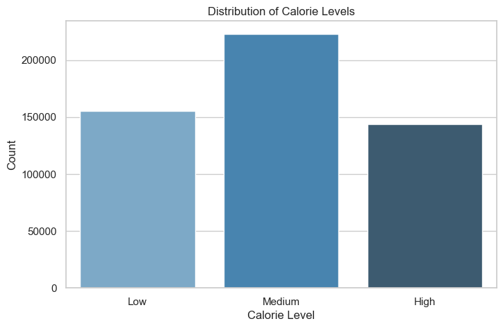
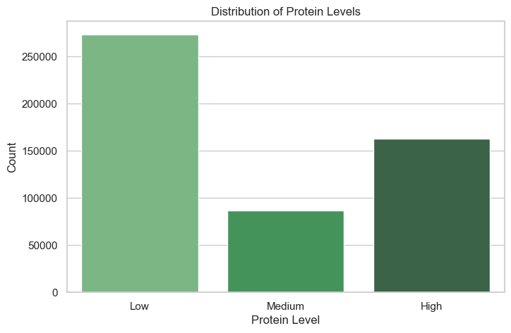
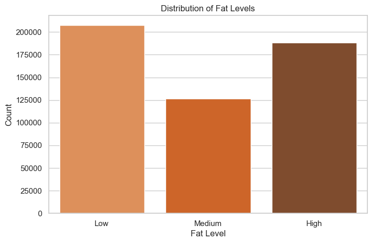
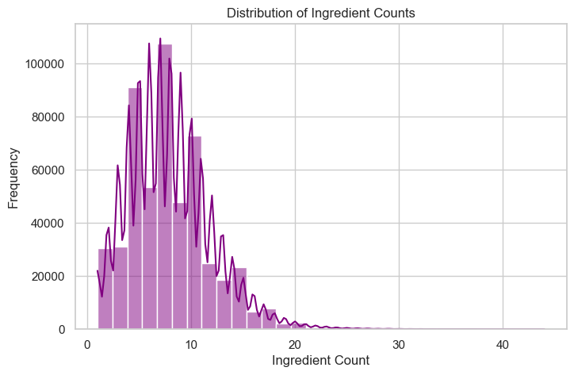
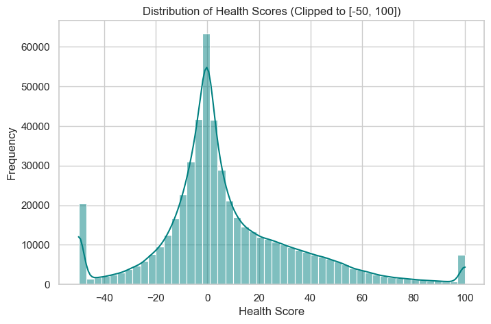
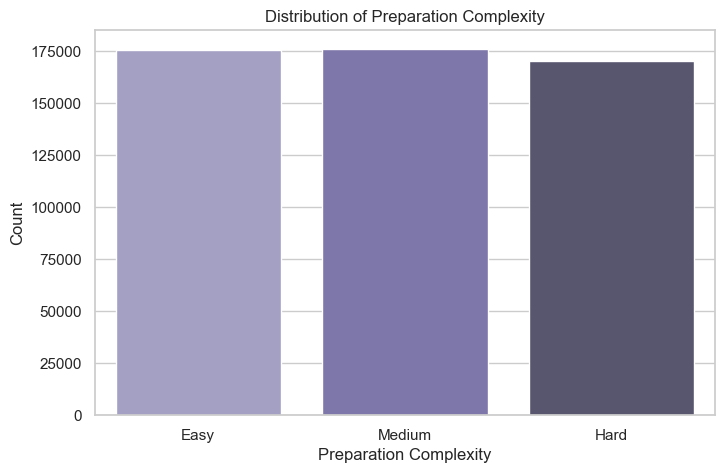

### **Week 2 - Data Cleaning, Preprocessing, and Feature Engineering**

Goal: Convert raw food interaction data into clean train/test data and engineered food metadata features.

<table style="width: 100%; border-collapse: collapse; font-family: sans-serif; font-size: 14px;">
  <thead>
    <tr style="background-color: #5b9bd5; color: white;">
      <th style="border: 1px solid #7f7f7f; padding: 10px; text-align: left; font-weight: bold; width: 25%;">Task</th>
      <th style="border: 1px solid #7f7f7f; padding: 10px; text-align: left; font-weight: bold; width: 50%;">Details</th>
      <th style="border: 1px solid #7f7f7f; padding: 10px; text-align: left; font-weight: bold; width: 25%;">Deliverable</th>
    </tr>
  </thead>
  <tbody>
    <tr>
      <td style="border: 1px solid #7f7f7f; padding: 10px; vertical-align: top; font-weight: bold;">Clean Interaction Data</td>
      <td style="border: 1px solid #7f7f7f; padding: 10px; vertical-align: top;">Remove duplicate interactions, handle missing ratings, normalize ratings, filter sparse users/items, create implicit feedback label.</td>
      <td style="border: 1px solid #7f7f7f; padding: 10px; vertical-align: top;">03_data_preprocessing.ipynb</td>
    </tr>
    <tr>
      <td style="border: 1px solid #7f7f7f; padding: 10px; vertical-align: top; font-weight: bold;">Food Metadata Table</td>
      <td style="border: 1px solid #7f7f7f; padding: 10px; vertical-align: top;">Prepare item_id, recipe name, ingredients, calories, protein, fat, carbs, category, preparation time, and review text.</td>
      <td style="border: 1px solid #7f7f7f; padding: 10px; vertical-align: top;">food_metadata_clean.csv</td>
    </tr>
    <tr>
      <td style="border: 1px solid #7f7f7f; padding: 10px; vertical-align: top; font-weight: bold;">Nutrition Features</td>
      <td style="border: 1px solid #7f7f7f; padding: 10px; vertical-align: top;">Create calorie_level, protein_level, fat_level, ingredient_count, health_score, and preparation_complexity.</td>
      <td style="border: 1px solid #7f7f7f; padding: 10px; vertical-align: top;">04_feature_engineering.ipynb</td>
    </tr>
    <tr>
      <td style="border: 1px solid #7f7f7f; padding: 10px; vertical-align: top; font-weight: bold;">Train-Test Split</td>
      <td style="border: 1px solid #7f7f7f; padding: 10px; vertical-align: top;">Create user-wise 80:20 split for top-K recommendation evaluation.</td>
      <td style="border: 1px solid #7f7f7f; padding: 10px; vertical-align: top;">train_interactions.csv,<br>test_interactions.csv</td>
    </tr>
  </tbody>
</table>


```python
import  pandas as pd
import numpy as np
```


```python
df=pd.read_csv("food_metadata_clean.csv")
```


```python
df.columns=df.columns.str.strip().str.lower()
```


```python
print(df.shape)
```

    (522517, 10)
    


```python
print(df.head)
```

    <bound method NDFrame.head of         item_id                                       recipe_name  \
    0            38                 Low-Fat Berry Blue Frozen Dessert   
    1            39                                           Biryani   
    2            40                                     Best Lemonade   
    3            41                    Carina's Tofu-Vegetable Kebabs   
    4            42                                      Cabbage Soup   
    ...         ...                                               ...   
    522512   541379                    Meg's Fresh Ginger Gingerbread   
    522513   541380  Roast Prime Rib au Poivre with Mixed Peppercorns   
    522514   541381                             Kirshwasser Ice Cream   
    522515   541382          Quick & Easy Asian Cucumber Salmon Rolls   
    522516   541383                           Spicy Baked Scotch Eggs   
    
                                                  ingredients  calories  protein  \
    0       c("blueberries", "granulated sugar", "vanilla ...     170.9      3.2   
    1       c("saffron", "milk", "hot green chili peppers"...    1110.7     63.4   
    2       c("sugar", "lemons, rind of", "lemon, zest of"...     311.1      0.3   
    3       c("extra firm tofu", "eggplant", "zucchini", "...     536.1     29.3   
    4       c("plain tomato juice", "cabbage", "onion", "c...     103.6      4.3   
    ...                                                   ...       ...      ...   
    522512  c("fresh ginger", "unsalted butter", "dark bro...     316.6      3.9   
    522513  c("Dijon mustard", "garlic", "peppercorns", "s...    2063.4    117.0   
    522514  c("half-and-half", "heavy cream", "brandy", "s...    1271.3     12.8   
    522515  c("wasabi paste", "dill", "English cucumber", ...      16.1      2.4   
    522516  c("hard-boiled eggs", "breakfast sausage", "pa...    1093.3     76.4   
    
              fat  carbs         category  prep_time  \
    0         2.5   37.1  Frozen Desserts     1485.0   
    1        58.8   84.4   Chicken Breast      265.0   
    2         0.2   81.5        Beverages       35.0   
    3        24.0   64.2         Soy/Tofu     1460.0   
    4         0.4   25.1        Vegetable       50.0   
    ...       ...    ...              ...        ...   
    522512   12.5   48.5          Dessert       95.0   
    522513  172.4    3.2   Very Low Carbs      210.0   
    522514  117.2   33.9        Ice Cream      240.0   
    522515    0.6    0.3         Canadian       15.0   
    522516   71.2   29.7        Breakfast       40.0   
    
                                                 instructions  
    0       c("Toss 2 cups berries with sugar.", "Let stan...  
    1       c("Soak saffron in warm milk for 5 minutes and...  
    2       c("Into a 1 quart Jar with tight fitting lid, ...  
    3       c("Drain the tofu, carefully squeezing out exc...  
    4       c("Mix everything together and bring to a boil...  
    ...                                                   ...  
    522512  c("Preheat oven to 350&deg;F Grease an 8x8 cak...  
    522513  c("Position rack in center of oven and preheat...  
    522514  c("heat half and half and heavy cream to a sim...  
    522515  c("In a small bowl, combine mayo and wasabi pa...  
    522516  c("Mix sausage, panko, egg yolk and Wocestersh...  
    
    [522517 rows x 10 columns]>
    


```python
numeric_cols = ['calories', 'protein', 'fat', 'carbs', 'prep_time']

for col in numeric_cols:
    df[col] = pd.to_numeric(df[col], errors='coerce').fillna(0)
```


```python
def calorie_level(x):
    if x < 200:
        return "Low"
    elif x < 500:
        return "Medium"
    else:
        return "High"

df['calorie_level'] = df['calories'].apply(calorie_level)
```


```python
df['protein_level'] = df['protein'].apply(
    lambda x: "High" if x > 20 else "Medium" if x > 10 else "Low"
)
```


```python
df['fat_level'] = df['fat'].apply(
    lambda x: "High" if x > 20 else "Medium" if x > 10 else "Low"
)
```


```python
df['ingredient_count'] = df['ingredients'].apply(
    lambda x: len(str(x).split(","))
)
```


```python
df['health_score'] = (
    df['protein'] * 2 - df['fat'] - df['calories'] * 0.01
)
```


```python
df['preparation_complexity'] = df['prep_time'].apply(
    lambda x: "Easy" if x < 30 else "Medium" if x < 60 else "Hard"
)
```

### **Visualizing Engineered Features**

Here we visualize the distribution of each engineered feature.


```python
import matplotlib.pyplot as plt
import seaborn as sns
import os

sns.set_theme(style="whitegrid")
os.makedirs("output_of_the feature_engineering", exist_ok=True)
os.makedirs("output", exist_ok=True)

# 1. Calorie Level Distribution
plt.figure(figsize=(8, 5))
sns.countplot(x='calorie_level', data=df, order=["Low", "Medium", "High"], palette="Blues_d")
plt.title("Distribution of Calorie Levels")
plt.xlabel("Calorie Level")
plt.ylabel("Count")
plt.savefig("output_of_the feature_engineering/calorie_level_distribution.png", dpi=150, bbox_inches='tight')
plt.savefig("output/calorie_level_distribution.png", dpi=150, bbox_inches='tight')
plt.show()
```

    C:\Users\ishan shastri\AppData\Local\Temp\ipykernel_22656\2974625744.py:11: FutureWarning: 
    
    Passing `palette` without assigning `hue` is deprecated and will be removed in v0.14.0. Assign the `x` variable to `hue` and set `legend=False` for the same effect.
    
      sns.countplot(x='calorie_level', data=df, order=["Low", "Medium", "High"], palette="Blues_d")
    


    

    


```python
# 2. Protein Level Distribution
plt.figure(figsize=(8, 5))
sns.countplot(x='protein_level', data=df, order=["Low", "Medium", "High"], palette="Greens_d")
plt.title("Distribution of Protein Levels")
plt.xlabel("Protein Level")
plt.ylabel("Count")
plt.savefig("output_of_the feature_engineering/protein_level_distribution.png", dpi=150, bbox_inches='tight')
plt.savefig("output/protein_level_distribution.png", dpi=150, bbox_inches='tight')
plt.show()
```

    C:\Users\ishan shastri\AppData\Local\Temp\ipykernel_22656\2799164640.py:3: FutureWarning: 
    
    Passing `palette` without assigning `hue` is deprecated and will be removed in v0.14.0. Assign the `x` variable to `hue` and set `legend=False` for the same effect.
    
      sns.countplot(x='protein_level', data=df, order=["Low", "Medium", "High"], palette="Greens_d")
    


    

    


```python
# 3. Fat Level Distribution
plt.figure(figsize=(8, 5))
sns.countplot(x='fat_level', data=df, order=["Low", "Medium", "High"], palette="Oranges_d")
plt.title("Distribution of Fat Levels")
plt.xlabel("Fat Level")
plt.ylabel("Count")
plt.savefig("output_of_the feature_engineering/fat_level_distribution.png", dpi=150, bbox_inches='tight')
plt.savefig("output/fat_level_distribution.png", dpi=150, bbox_inches='tight')
plt.show()
```

    C:\Users\ishan shastri\AppData\Local\Temp\ipykernel_22656\4072002139.py:3: FutureWarning: 
    
    Passing `palette` without assigning `hue` is deprecated and will be removed in v0.14.0. Assign the `x` variable to `hue` and set `legend=False` for the same effect.
    
      sns.countplot(x='fat_level', data=df, order=["Low", "Medium", "High"], palette="Oranges_d")
    


    

    


```python
# 4. Ingredient Count Distribution
plt.figure(figsize=(8, 5))
sns.histplot(df['ingredient_count'], bins=30, kde=True, color="purple")
plt.title("Distribution of Ingredient Counts")
plt.xlabel("Ingredient Count")
plt.ylabel("Frequency")
plt.savefig("output_of_the feature_engineering/ingredient_count_distribution.png", dpi=150, bbox_inches='tight')
plt.savefig("output/ingredient_count_distribution.png", dpi=150, bbox_inches='tight')
plt.show()
```


    

    


```python
# 5. Health Score Distribution
plt.figure(figsize=(8, 5))
sns.histplot(df['health_score'].clip(-50, 100), bins=50, kde=True, color="teal")
plt.title("Distribution of Health Scores (Clipped to [-50, 100])")
plt.xlabel("Health Score")
plt.ylabel("Frequency")
plt.savefig("output_of_the feature_engineering/health_score_distribution.png", dpi=150, bbox_inches='tight')
plt.savefig("output/health_score_distribution.png", dpi=150, bbox_inches='tight')
plt.show()
```


    

    


```python
# 6. Preparation Complexity Distribution
plt.figure(figsize=(8, 5))
sns.countplot(x='preparation_complexity', data=df, order=["Easy", "Medium", "Hard"], palette="Purples_d")
plt.title("Distribution of Preparation Complexity")
plt.xlabel("Preparation Complexity")
plt.ylabel("Count")
plt.savefig("output_of_the feature_engineering/preparation_complexity_distribution.png", dpi=150, bbox_inches='tight')
plt.savefig("output/preparation_complexity_distribution.png", dpi=150, bbox_inches='tight')
plt.show()
```

    C:\Users\ishan shastri\AppData\Local\Temp\ipykernel_22656\2567598157.py:3: FutureWarning: 
    
    Passing `palette` without assigning `hue` is deprecated and will be removed in v0.14.0. Assign the `x` variable to `hue` and set `legend=False` for the same effect.
    
      sns.countplot(x='preparation_complexity', data=df, order=["Easy", "Medium", "Hard"], palette="Purples_d")
    


    

    


```python
df[['calories','calorie_level',
    'protein','protein_level',
    'fat','fat_level',
    'ingredient_count',
    'health_score',
    'prep_time','preparation_complexity']].head()
```


<div>
<style scoped>
    .dataframe tbody tr th:only-of-type {
        vertical-align: middle;
    }

    .dataframe tbody tr th {
        vertical-align: top;
    }

    .dataframe thead th {
        text-align: right;
    }
</style>
<table border="1" class="dataframe">
  <thead>
    <tr style="text-align: right;">
      <th></th>
      <th>calories</th>
      <th>calorie_level</th>
      <th>protein</th>
      <th>protein_level</th>
      <th>fat</th>
      <th>fat_level</th>
      <th>ingredient_count</th>
      <th>health_score</th>
      <th>prep_time</th>
      <th>preparation_complexity</th>
    </tr>
  </thead>
  <tbody>
    <tr>
      <th>0</th>
      <td>170.9</td>
      <td>Low</td>
      <td>3.2</td>
      <td>Low</td>
      <td>2.5</td>
      <td>Low</td>
      <td>4</td>
      <td>2.191</td>
      <td>1485.0</td>
      <td>Hard</td>
    </tr>
    <tr>
      <th>1</th>
      <td>1110.7</td>
      <td>High</td>
      <td>63.4</td>
      <td>High</td>
      <td>58.8</td>
      <td>High</td>
      <td>25</td>
      <td>56.893</td>
      <td>265.0</td>
      <td>Hard</td>
    </tr>
    <tr>
      <th>2</th>
      <td>311.1</td>
      <td>Medium</td>
      <td>0.3</td>
      <td>Low</td>
      <td>0.2</td>
      <td>Low</td>
      <td>7</td>
      <td>-2.711</td>
      <td>35.0</td>
      <td>Medium</td>
    </tr>
    <tr>
      <th>3</th>
      <td>536.1</td>
      <td>High</td>
      <td>29.3</td>
      <td>High</td>
      <td>24.0</td>
      <td>High</td>
      <td>14</td>
      <td>29.239</td>
      <td>1460.0</td>
      <td>Hard</td>
    </tr>
    <tr>
      <th>4</th>
      <td>103.6</td>
      <td>Low</td>
      <td>4.3</td>
      <td>Low</td>
      <td>0.4</td>
      <td>Low</td>
      <td>5</td>
      <td>7.164</td>
      <td>50.0</td>
      <td>Medium</td>
    </tr>
  </tbody>
</table>
</div>


```python
df.to_csv("food_features_engineered.csv", index=False)

print("✅ Feature Engineering Done")
```

    ✅ Feature Engineering Done
    


```python

```
