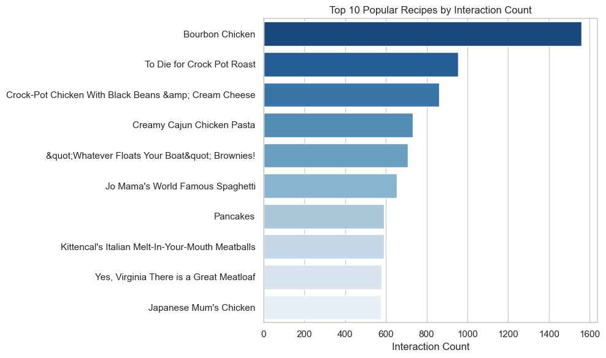
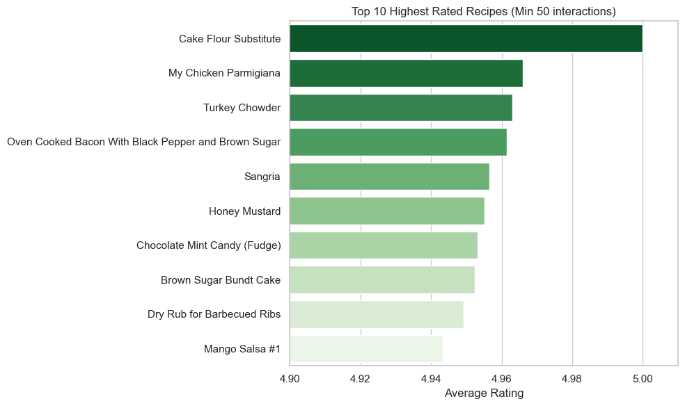

# 05. Popularity and Rating Based Recommenders

This notebook implements non-personalized recommenders based on item popularity (interaction count) and average rating.


```python
import pandas as pd
import numpy as np
import os

# Set paths
data_dir = '.'
train_path = os.path.join(data_dir, 'train_interactions.csv')
features_path = os.path.join(data_dir, 'food_features_engineered.csv')
import matplotlib.pyplot as plt
import seaborn as sns

# Set plotting style
sns.set_theme(style='whitegrid')

```

## 1. Load Data


```python
print('Loading data...')
train_df = pd.read_csv(train_path)
features_df = pd.read_csv(features_path)
print(f'Train shape: {train_df.shape}')
print(f'Features shape: {features_df.shape}')
```

    Loading data...
    Train shape: (616473, 10)
    Features shape: (522517, 16)
    

## 2. Popularity-Based Recommender

Recommend the most interacted food items.


```python
# Count interactions per recipe
popularity_df = train_df.groupby('recipeid').size().reset_index(name='interaction_count')
popularity_df = popularity_df.sort_values('interaction_count', ascending=False)

# Merge with recipe names
popularity_df = popularity_df.merge(features_df[['item_id', 'recipe_name']], left_on='recipeid', right_on='item_id', how='left')

print('Top 10 Popular Recipes:')
display(popularity_df.head(10))
```

    Top 10 Popular Recipes:
    


<div>
<style scoped>
    .dataframe tbody tr th:only-of-type {
        vertical-align: middle;
    }

    .dataframe tbody tr th {
        vertical-align: top;
    }

    .dataframe thead th {
        text-align: right;
    }
</style>
<table border="1" class="dataframe">
  <thead>
    <tr style="text-align: right;">
      <th></th>
      <th>recipeid</th>
      <th>interaction_count</th>
      <th>item_id</th>
      <th>recipe_name</th>
    </tr>
  </thead>
  <tbody>
    <tr>
      <th>0</th>
      <td>45809</td>
      <td>1560</td>
      <td>45809.0</td>
      <td>Bourbon Chicken</td>
    </tr>
    <tr>
      <th>1</th>
      <td>27208</td>
      <td>956</td>
      <td>27208.0</td>
      <td>To Die for Crock Pot Roast</td>
    </tr>
    <tr>
      <th>2</th>
      <td>89204</td>
      <td>861</td>
      <td>89204.0</td>
      <td>Crock-Pot Chicken With Black Beans &amp;amp; Cream...</td>
    </tr>
    <tr>
      <th>3</th>
      <td>39087</td>
      <td>732</td>
      <td>39087.0</td>
      <td>Creamy Cajun Chicken Pasta</td>
    </tr>
    <tr>
      <th>4</th>
      <td>32204</td>
      <td>707</td>
      <td>32204.0</td>
      <td>&amp;quot;Whatever Floats Your Boat&amp;quot; Brownies!</td>
    </tr>
    <tr>
      <th>5</th>
      <td>22782</td>
      <td>653</td>
      <td>22782.0</td>
      <td>Jo Mama's World Famous Spaghetti</td>
    </tr>
    <tr>
      <th>6</th>
      <td>25690</td>
      <td>592</td>
      <td>25690.0</td>
      <td>Pancakes</td>
    </tr>
    <tr>
      <th>7</th>
      <td>69173</td>
      <td>590</td>
      <td>69173.0</td>
      <td>Kittencal's Italian Melt-In-Your-Mouth Meatballs</td>
    </tr>
    <tr>
      <th>8</th>
      <td>54257</td>
      <td>579</td>
      <td>54257.0</td>
      <td>Yes, Virginia There is a Great Meatloaf</td>
    </tr>
    <tr>
      <th>9</th>
      <td>68955</td>
      <td>575</td>
      <td>68955.0</td>
      <td>Japanese Mum's Chicken</td>
    </tr>
  </tbody>
</table>
</div>


```python
# Plot Top 10 Popular Recipes
plt.figure(figsize=(10, 6))
sns.barplot(data=popularity_df.head(10), x='interaction_count', y='recipe_name', palette='Blues_r')
plt.title('Top 10 Popular Recipes by Interaction Count')
plt.xlabel('Interaction Count')
plt.ylabel('')
plt.tight_layout()
plt.show()
```

    C:\Users\ishan shastri\AppData\Local\Temp\ipykernel_21512\1516836270.py:3: FutureWarning: 
    
    Passing `palette` without assigning `hue` is deprecated and will be removed in v0.14.0. Assign the `y` variable to `hue` and set `legend=False` for the same effect.
    
      sns.barplot(data=popularity_df.head(10), x='interaction_count', y='recipe_name', palette='Blues_r')
    


    

    


## 3. Rating-Based Recommender

Recommend the highest-rated items that meet a minimum interaction threshold.


```python
min_interactions = 50

# Calculate average rating and interaction count
rating_df = train_df.groupby('recipeid').agg(
    avg_rating=('rating', 'mean'),
    interaction_count=('rating', 'count')
).reset_index()

# Filter by threshold
rating_based_df = rating_df[rating_df['interaction_count'] >= min_interactions]
rating_based_df = rating_based_df.sort_values('avg_rating', ascending=False)

# Merge with recipe names
rating_based_df = rating_based_df.merge(features_df[['item_id', 'recipe_name']], left_on='recipeid', right_on='item_id', how='left')

print(f'Top 10 Highest Rated Recipes (Min {min_interactions} interactions):')
display(rating_based_df.head(10))
```

    Top 10 Highest Rated Recipes (Min 50 interactions):
    


<div>
<style scoped>
    .dataframe tbody tr th:only-of-type {
        vertical-align: middle;
    }

    .dataframe tbody tr th {
        vertical-align: top;
    }

    .dataframe thead th {
        text-align: right;
    }
</style>
<table border="1" class="dataframe">
  <thead>
    <tr style="text-align: right;">
      <th></th>
      <th>recipeid</th>
      <th>avg_rating</th>
      <th>interaction_count</th>
      <th>item_id</th>
      <th>recipe_name</th>
    </tr>
  </thead>
  <tbody>
    <tr>
      <th>0</th>
      <td>87689</td>
      <td>5.000000</td>
      <td>54</td>
      <td>87689</td>
      <td>Cake Flour Substitute</td>
    </tr>
    <tr>
      <th>1</th>
      <td>25094</td>
      <td>4.966102</td>
      <td>59</td>
      <td>25094</td>
      <td>My Chicken Parmigiana</td>
    </tr>
    <tr>
      <th>2</th>
      <td>73348</td>
      <td>4.962963</td>
      <td>54</td>
      <td>73348</td>
      <td>Turkey Chowder</td>
    </tr>
    <tr>
      <th>3</th>
      <td>107440</td>
      <td>4.961538</td>
      <td>52</td>
      <td>107440</td>
      <td>Oven Cooked Bacon With Black Pepper and Brown ...</td>
    </tr>
    <tr>
      <th>4</th>
      <td>46365</td>
      <td>4.956522</td>
      <td>92</td>
      <td>46365</td>
      <td>Sangria</td>
    </tr>
    <tr>
      <th>5</th>
      <td>13228</td>
      <td>4.955224</td>
      <td>67</td>
      <td>13228</td>
      <td>Honey Mustard</td>
    </tr>
    <tr>
      <th>6</th>
      <td>4075</td>
      <td>4.953125</td>
      <td>64</td>
      <td>4075</td>
      <td>Chocolate Mint Candy (Fudge)</td>
    </tr>
    <tr>
      <th>7</th>
      <td>42976</td>
      <td>4.952381</td>
      <td>84</td>
      <td>42976</td>
      <td>Brown Sugar Bundt Cake</td>
    </tr>
    <tr>
      <th>8</th>
      <td>10840</td>
      <td>4.949153</td>
      <td>59</td>
      <td>10840</td>
      <td>Dry Rub for Barbecued Ribs</td>
    </tr>
    <tr>
      <th>9</th>
      <td>63621</td>
      <td>4.943396</td>
      <td>53</td>
      <td>63621</td>
      <td>Mango Salsa #1</td>
    </tr>
  </tbody>
</table>
</div>


```python
# Plot Top 10 Highest Rated Recipes
plt.figure(figsize=(10, 6))
sns.barplot(data=rating_based_df.head(10), x='avg_rating', y='recipe_name', palette='Greens_r')
plt.xlim(4.9, 5.01) # Zoom in to see differences
plt.title(f'Top 10 Highest Rated Recipes (Min {min_interactions} interactions)')
plt.xlabel('Average Rating')
plt.ylabel('')
plt.tight_layout()
plt.show()
```

    C:\Users\ishan shastri\AppData\Local\Temp\ipykernel_21512\426556737.py:3: FutureWarning: 
    
    Passing `palette` without assigning `hue` is deprecated and will be removed in v0.14.0. Assign the `y` variable to `hue` and set `legend=False` for the same effect.
    
      sns.barplot(data=rating_based_df.head(10), x='avg_rating', y='recipe_name', palette='Greens_r')
    


    

    


## 4. Save Predictions for Evaluation

For evaluation, we just need the ordered list of items for these baselines.


```python
import pickle

# Top 1000 items should be plenty for evaluation up to K=10
pop_recs = popularity_df['recipeid'].head(1000).tolist()
rating_recs = rating_based_df['recipeid'].head(1000).tolist()

os.makedirs('output', exist_ok=True)
with open('output/pop_recs.pkl', 'wb') as f:
    pickle.dump(pop_recs, f)
    
with open('output/rating_recs.pkl', 'wb') as f:
    pickle.dump(rating_recs, f)
    
print('Saved popularity and rating recommendations to output/')
```

    Saved popularity and rating recommendations to output/
    


```python

```
