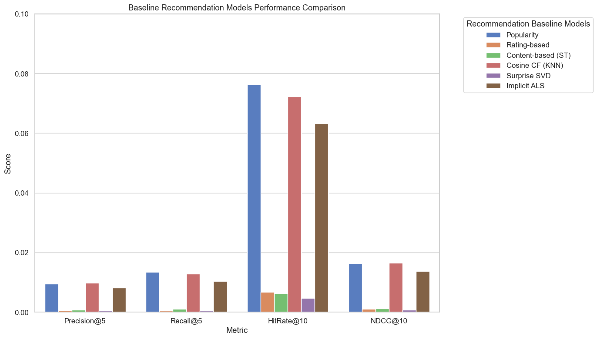

# 08 - Evaluation Metrics and Baseline Model Comparison

**Project:** GroundedNutriRec  
**Role:** Baseline Recommendation + Evaluation Lead  
**Scope:** Implement ranking metrics (Precision@K, Recall@K, HitRate@K, NDCG@K, MRR@K) and evaluate all baseline recommender models (Popularity-based, Rating-based, Content-based using Sentence Transformers, and Collaborative Filtering models: User Cosine KNN, Surprise SVD, and Implicit ALS) on the Food.com dataset.

## Objectives:
1. Load the preprocessed interaction splits (`train_interactions.csv`, `test_interactions.csv`) and recipe metadata (`food_metadata_clean.csv`).
2. Load cached Sentence Transformer embeddings for Content-based representation.
3. Implement evaluation metrics: Precision@K, Recall@K, HitRate@K, NDCG@K, and MRR@K.
4. Train and evaluate all baseline recommenders:
   - **Popularity-based Recommender** (from notebook 05)
   - **Rating-based Recommender** (from notebook 05)
   - **Content-based Recommender using Sentence Transformers** (from notebook 06)
   - **User-Based Cosine Similarity KNN CF** (from notebook 07)
   - **Surprise SVD Matrix Factorization** (from notebook 07)
   - **Implicit ALS Collaborative Filtering** (from notebook 07)
5. Output a comparative performance table and visualization charts comparing the baselines.

## 1. Setup and Imports


```python
import sys
import os
import time
from pathlib import Path
import pandas as pd
import numpy as np
import matplotlib.pyplot as plt
import seaborn as sns
from scipy.sparse import csr_matrix
from sklearn.metrics.pairwise import cosine_similarity
from surprise import Dataset, Reader, SVD
from implicit.als import AlternatingLeastSquares

sns.set_theme(style='whitegrid', font_scale=1.1)
print("Setup complete. Libraries imported successfully.")
```

    Setup complete. Libraries imported successfully.
    

## 2. Load Processed Datasets


```python
import os
from pathlib import Path
# Determine project root dynamically
notebook_dir = Path.cwd()
if notebook_dir.name == 'NOTEBOOKS':
    project_root = notebook_dir.parent
else:
    project_root = notebook_dir

DATA_DIR = project_root / 'DATA' / 'PROCESSED'

train_path = DATA_DIR / 'train_interactions.csv'
test_path = DATA_DIR / 'test_interactions.csv'
meta_path = DATA_DIR / 'food_metadata_clean.csv'
embeddings_path = DATA_DIR / 'recipe_embeddings.npy'

print("Loading datasets...")
train_df = pd.read_csv(train_path)
test_df = pd.read_csv(test_path)
meta_df = pd.read_csv(meta_path)

print(f"Train interactions: {len(train_df):,}")
print(f"Test interactions:  {len(test_df):,}")
print(f"Recipe metadata:    {len(meta_df):,}")
```

    Loading datasets...
    

    Train interactions: 437,558
    Test interactions:  118,060
    Recipe metadata:    40,968
    

## 3. Contiguous ID Mappings


```python
all_users = sorted(list(set(train_df['user_id'].unique()) | set(test_df['user_id'].unique())))
all_recipes = sorted(list(set(train_df['recipe_id'].unique()) | set(test_df['recipe_id'].unique())))

user_to_idx = {uid: idx for idx, uid in enumerate(all_users)}
recipe_to_idx = {rid: idx for idx, rid in enumerate(all_recipes)}

idx_to_user = {idx: uid for uid, idx in user_to_idx.items()}
idx_to_recipe = {idx: rid for rid, idx in recipe_to_idx.items()}

num_users = len(all_users)
num_recipes = len(all_recipes)
print(f"Unique Users: {num_users}, Unique Recipes: {num_recipes}")
```

    Unique Users: 17813, Unique Recipes: 41240
    

## 4. Prepare Evaluation Targets and Masking Histories


```python
# Filter test set for positive interactions (liked = 1)
test_pos = test_df[test_df['liked'] == 1]
test_targets = test_pos.groupby('user_id')['recipe_id'].apply(list).to_dict()
test_users = list(test_targets.keys())
print(f"Number of test users with positive interactions: {len(test_users):,}")

# Group train set history to filter out already seen items
train_history = train_df.groupby('user_id')['recipe_id'].apply(set).to_dict()

recipe_id_to_matrix_idx = {rid: i for i, rid in enumerate(meta_df['id'])}
train_df['recipe_idx'] = train_df['recipe_id'].map(recipe_id_to_matrix_idx)

# Drop NaNs and cast to integer to prevent NumPy index errors
train_df_idx = train_df.dropna(subset=['recipe_idx']).copy()
train_df_idx['recipe_idx'] = train_df_idx['recipe_idx'].astype(int)

train_user_interacted = train_df_idx.groupby('user_id')['recipe_idx'].apply(set).to_dict()
train_user_liked = train_df_idx[train_df_idx['liked'] == 1].groupby('user_id')['recipe_idx'].apply(list).to_dict()
train_user_all = train_df_idx.groupby('user_id')['recipe_idx'].apply(list).to_dict()
```

    Number of test users with positive interactions: 17,329
    

## 5. Implement Evaluation Metrics


```python
def evaluate_model(recommendations_dict, k_list=[5, 10]):
    """
    evaluate_model

    Evaluates a set of user recommendations against ground truth test liked recipes
    using standard ranking metrics: Precision@K, Recall@K, HitRate@K, NDCG@K, MRR@K.

    @param  recommendations_dict - Dictionary mapping user IDs to lists of recipe IDs.
    @param  k_list               - Cutoff values for evaluation (e.g. 5, 10).
    @returns dict                - Evaluated metric values at each K.
    @validates                  - Checks that actual positive feedback exists.
    @edge-cases                 - Divides by zero safely if liked test set is empty.
    """
    metrics = {k: {'precision': [], 'recall': [], 'hitrate': [], 'ndcg': [], 'mrr': []} for k in k_list}
    
    for uid in test_users:
        actual = test_targets[uid]
        recs = recommendations_dict.get(uid, [])
        
        for k in k_list:
            recs_k = recs[:k]
            hits = len(set(recs_k) & set(actual))
            
            precision = hits / k
            recall = hits / len(actual) if len(actual) > 0 else 0.0
            hitrate = 1.0 if hits > 0 else 0.0
            
            dcg = 0.0
            for i, p in enumerate(recs_k):
                if p in actual:
                    dcg += 1.0 / np.log2(i + 2)
            idcg = sum([1.0 / np.log2(i + 2) for i in range(min(k, len(actual)))])
            ndcg = dcg / idcg if idcg > 0.0 else 0.0
            
            mrr = 0.0
            for i, p in enumerate(recs_k):
                if p in actual:
                    mrr = 1.0 / (i + 1)
                    break
            
            metrics[k]['precision'].append(precision)
            metrics[k]['recall'].append(recall)
            metrics[k]['hitrate'].append(hitrate)
            metrics[k]['ndcg'].append(ndcg)
            metrics[k]['mrr'].append(mrr)
            
    results = {}
    for k in k_list:
        results[k] = {metric: np.mean(values) for metric, values in metrics[k].items()}
    return results
```

## 6. Popularity-based Recommender


```python
print("Training Popularity Recommender...")
popularity_scores = train_df['recipe_id'].value_counts().to_dict()
sorted_popularity = sorted(all_recipes, key=lambda r: popularity_scores.get(r, 0), reverse=True)

print("Generating Popularity Recommendations...")
pop_recommendations = {}
for uid in test_users:
    seen = train_history.get(uid, set())
    recs = []
    for r in sorted_popularity:
        if r not in seen:
            recs.append(r)
            if len(recs) == 10:
                break
    pop_recommendations[uid] = recs
```

    Training Popularity Recommender...
    Generating Popularity Recommendations...
    

## 7. Rating-based Recommender


```python
print("Training Rating-based Recommender...")
recipe_stats = train_df.groupby('recipe_id').agg(
    avg_rating=('rating', 'mean'),
    vote_count=('rating', 'count')
)

min_votes = 50
qualified_recipes = recipe_stats[recipe_stats['vote_count'] >= min_votes]
sorted_rating = qualified_recipes.sort_values(by=['avg_rating', 'vote_count'], ascending=[False, False]).index.tolist()

remaining = [r for r in all_recipes if r not in sorted_rating]
full_sorted_rating = sorted_rating + remaining

print("Generating Rating-based Recommendations...")
rating_recommendations = {}
for uid in test_users:
    seen = train_history.get(uid, set())
    recs = []
    for r in full_sorted_rating:
        if r not in seen:
            recs.append(r)
            if len(recs) == 10:
                break
    rating_recommendations[uid] = recs
```

    Training Rating-based Recommender...
    

    Generating Rating-based Recommendations...
    

## 8. Content-based Recommender (Sentence Transformers)


```python
print("Loading cached recipe embeddings...")
recipe_embeddings = np.load(embeddings_path)
print(f"Loaded embeddings of shape: {recipe_embeddings.shape}")

print("Computing user profiles for Content-based recommender...")
user_profiles = np.zeros((len(test_users), 384), dtype=np.float32)
for u_idx, uid in enumerate(test_users):
    liked_idx = train_user_liked.get(uid, [])
    if not liked_idx:
        liked_idx = train_user_all.get(uid, [])
    if liked_idx:
        valid_liked_idx = [int(idx) for idx in liked_idx if idx < len(recipe_embeddings)]
        if valid_liked_idx:
            user_profiles[u_idx] = recipe_embeddings[valid_liked_idx].mean(axis=0)

print("Generating Sentence Transformer Content-based Recommendations...")
content_recommendations = {}
batch_size = 1000
num_batches = int(np.ceil(len(test_users) / batch_size))

for b in range(num_batches):
    start_idx = b * batch_size
    end_idx = min(start_idx + batch_size, len(test_users))
    batch_uids = test_users[start_idx:end_idx]
    
    batch_sims = cosine_similarity(user_profiles[start_idx:end_idx], recipe_embeddings)
    
    for i, uid in enumerate(batch_uids):
        sims = batch_sims[i]
        
        interacted = list(train_user_interacted.get(uid, []))
        if interacted:
            valid_interacted = [idx for idx in interacted if idx < len(sims)]
            sims[valid_interacted] = -np.inf
            
        top10_partition = np.argpartition(sims, -10)[-10:]
        top10_idx = top10_partition[np.argsort(-sims[top10_partition])]
        
        content_recommendations[uid] = meta_df['id'].iloc[top10_idx].tolist()
```

    Loading cached recipe embeddings...
    Loaded embeddings of shape: (40968, 384)
    Computing user profiles for Content-based recommender...
    

    Generating Sentence Transformer Content-based Recommendations...
    

## 9. User-Based Cosine Similarity KNN Collaborative Filtering


```python
print("Constructing User-Item rating matrix...")
rows = train_df['user_id'].map(user_to_idx).values
cols = train_df['recipe_id'].map(recipe_to_idx).values
vals = train_df['rating'].values

rating_matrix = csr_matrix((vals, (rows, cols)), shape=(num_users, num_recipes))

print("Computing user cosine similarity...")
user_sim = cosine_similarity(rating_matrix, dense_output=True)
np.fill_diagonal(user_sim, 0)

print("Sparsifying similarity matrix (top K=100 nearest neighbors)...")
k_neighbors = 100
for i in range(num_users):
    row = user_sim[i]
    threshold = np.partition(row, -k_neighbors)[-k_neighbors]
    row[row < threshold] = 0.0

user_sim_sparse = csr_matrix(user_sim)

print("Generating User-Based Cosine CF recommendations...")
cosine_recs = {}
chunk_size = 2000
for start_idx in range(0, num_users, chunk_size):
    end_idx = min(start_idx + chunk_size, num_users)
    chunk_scores = user_sim_sparse[start_idx:end_idx].dot(rating_matrix).toarray()
    
    for i in range(start_idx, end_idx):
        uid = idx_to_user[i]
        if uid in test_targets:
            seen = train_history.get(uid, set())
            scores = chunk_scores[i - start_idx]
            for r in seen:
                if r in recipe_to_idx:
                    scores[recipe_to_idx[r]] = -np.inf
            top_indices = np.argsort(scores)[::-1][:10]
            cosine_recs[uid] = [idx_to_recipe[idx] for idx in top_indices]
```

    Constructing User-Item rating matrix...
    Computing user cosine similarity...
    

    Sparsifying similarity matrix (top K=100 nearest neighbors)...
    

    Generating User-Based Cosine CF recommendations...
    

## 10. Surprise SVD Matrix Factorization


```python
print("Preparing data for Surprise SVD...")
reader = Reader(rating_scale=(1, 5))
surprise_data = Dataset.load_from_df(train_df[['user_id', 'recipe_id', 'rating']], reader)
trainset = surprise_data.build_full_trainset()

print("Training Surprise SVD model...")
svd_model = SVD(n_factors=20, n_epochs=15, random_state=42)
svd_model.fit(trainset)

print("Generating Surprise SVD recommendations...")
n_factors = svd_model.n_factors
pu_aligned = np.zeros((num_users, n_factors))
bu_aligned = np.zeros(num_users)
for idx, uid in idx_to_user.items():
    try:
        inner_uid = trainset.to_inner_uid(uid)
        pu_aligned[idx] = svd_model.pu[inner_uid]
        bu_aligned[idx] = svd_model.bu[inner_uid]
    except ValueError:
        pass

qi_aligned = np.zeros((num_recipes, n_factors))
bi_aligned = np.zeros(num_recipes)
for idx, rid in idx_to_recipe.items():
    try:
        inner_iid = trainset.to_inner_iid(rid)
        qi_aligned[idx] = svd_model.qi[inner_iid]
        bi_aligned[idx] = svd_model.bi[inner_iid]
    except ValueError:
        pass

global_mean = trainset.global_mean

svd_recs = {}
for start_idx in range(0, num_users, chunk_size):
    end_idx = min(start_idx + chunk_size, num_users)
    chunk_scores = (
        global_mean +
        bu_aligned[start_idx:end_idx, np.newaxis] +
        bi_aligned[np.newaxis, :] +
        np.dot(pu_aligned[start_idx:end_idx], qi_aligned.T)
    )
    for i in range(start_idx, end_idx):
        uid = idx_to_user[i]
        if uid in test_targets:
            seen = train_history.get(uid, set())
            scores = chunk_scores[i - start_idx]
            for r in seen:
                if r in recipe_to_idx:
                    scores[recipe_to_idx[r]] = -np.inf
            top_indices = np.argsort(scores)[::-1][:10]
            svd_recs[uid] = [idx_to_recipe[idx] for idx in top_indices]
```

    Preparing data for Surprise SVD...
    

    Training Surprise SVD model...
    

    Generating Surprise SVD recommendations...
    

## 11. Implicit ALS (Alternating Least Squares)


```python
print("Preparing data for Implicit ALS...")
train_implicit = train_df[train_df['liked'].notna()].copy()
train_implicit['liked'] = train_implicit['liked'].astype(np.float32)

als_rows = train_implicit['user_id'].map(user_to_idx).values
als_cols = train_implicit['recipe_id'].map(recipe_to_idx).values
als_vals = train_implicit['liked'].values

user_items_als = csr_matrix((als_vals, (als_rows, als_cols)), shape=(num_users, num_recipes))

print("Training Implicit ALS model...")
als_model = AlternatingLeastSquares(factors=64, regularization=0.05, iterations=15, random_state=42)
als_model.fit(user_items_als)

print("Generating Implicit ALS recommendations...")
als_recs = {}
test_user_indices = [user_to_idx[uid] for uid in test_users]
ids_batch, scores_batch = als_model.recommend(
    test_user_indices,
    user_items_als[test_user_indices],
    N=10,
    filter_already_liked_items=True
)

for idx, uid in enumerate(test_users):
    als_recs[uid] = [idx_to_recipe[item_idx] for item_idx in ids_batch[idx]]
```

    Preparing data for Implicit ALS...
    Training Implicit ALS model...
    

    C:\Users\Kush Shah\AppData\Local\Programs\Python\Python313\Lib\site-packages\implicit\cpu\als.py:96: RuntimeWarning: OpenBLAS is configured to use 18 threads. It is highly recommended to disable its internal threadpool by setting the environment variable 'OPENBLAS_NUM_THREADS=1' or by calling 'threadpoolctl.threadpool_limits(1, "blas")'. Having OpenBLAS use a threadpool can lead to severe performance issues here.
      check_blas_config()
    


      0%|          | 0/15 [00:00<?, ?it/s]


    Generating Implicit ALS recommendations...
    

## 12. Model Evaluations


```python
print("Evaluating Popularity Recommender...")
pop_results = evaluate_model(pop_recommendations)

print("Evaluating Rating-based Recommender...")
rating_results = evaluate_model(rating_recommendations)

print("Evaluating Content-based (Sentence Transformers) Recommender...")
content_results = evaluate_model(content_recommendations)

print("Evaluating Cosine Similarity CF...")
cosine_results = evaluate_model(cosine_recs)

print("Evaluating Surprise SVD...")
svd_results = evaluate_model(svd_recs)

print("Evaluating Implicit ALS...")
als_results = evaluate_model(als_recs)
```

    Evaluating Popularity Recommender...
    

    Evaluating Rating-based Recommender...
    

    Evaluating Content-based (Sentence Transformers) Recommender...
    

    Evaluating Cosine Similarity CF...
    

    Evaluating Surprise SVD...
    

    Evaluating Implicit ALS...
    

## 13. Final Results and Model Comparison


```python
print("="*108)
print(f"{'Model':<25} | {'Prec@5':<8} | {'Recall@5':<8} | {'Prec@10':<8} | {'Recall@10':<8} | {'HR@10':<8} | {'NDCG@10':<8} | {'MRR@10':<8}")
print("="*108)
print(f"{'Popularity':<25} | {pop_results[5]['precision']:.6f} | {pop_results[5]['recall']:.6f} | {pop_results[10]['precision']:.6f} | {pop_results[10]['recall']:.6f} | {pop_results[10]['hitrate']:.6f} | {pop_results[10]['ndcg']:.6f} | {pop_results[10]['mrr']:.6f}")
print(f"{'Rating-based':<25} | {rating_results[5]['precision']:.6f} | {rating_results[5]['recall']:.6f} | {rating_results[10]['precision']:.6f} | {rating_results[10]['recall']:.6f} | {rating_results[10]['hitrate']:.6f} | {rating_results[10]['ndcg']:.6f} | {rating_results[10]['mrr']:.6f}")
print(f"{'Content-based (ST)':<25} | {content_results[5]['precision']:.6f} | {content_results[5]['recall']:.6f} | {content_results[10]['precision']:.6f} | {content_results[10]['recall']:.6f} | {content_results[10]['hitrate']:.6f} | {content_results[10]['ndcg']:.6f} | {content_results[10]['mrr']:.6f}")
print(f"{'Cosine CF (KNN)':<25} | {cosine_results[5]['precision']:.6f} | {cosine_results[5]['recall']:.6f} | {cosine_results[10]['precision']:.6f} | {cosine_results[10]['recall']:.6f} | {cosine_results[10]['hitrate']:.6f} | {cosine_results[10]['ndcg']:.6f} | {cosine_results[10]['mrr']:.6f}")
print(f"{'Surprise SVD':<25} | {svd_results[5]['precision']:.6f} | {svd_results[5]['recall']:.6f} | {svd_results[10]['precision']:.6f} | {svd_results[10]['recall']:.6f} | {svd_results[10]['hitrate']:.6f} | {svd_results[10]['ndcg']:.6f} | {svd_results[10]['mrr']:.6f}")
print(f"{'Implicit ALS':<25} | {als_results[5]['precision']:.6f} | {als_results[5]['recall']:.6f} | {als_results[10]['precision']:.6f} | {als_results[10]['recall']:.6f} | {als_results[10]['hitrate']:.6f} | {als_results[10]['ndcg']:.6f} | {als_results[10]['mrr']:.6f}")
print("="*108)
```

    ============================================================================================================
    Model                     | Prec@5   | Recall@5 | Prec@10  | Recall@10 | HR@10    | NDCG@10  | MRR@10  
    ============================================================================================================
    Popularity                | 0.009556 | 0.013479 | 0.008437 | 0.023236 | 0.076404 | 0.016396 | 0.025341
    Rating-based              | 0.000646 | 0.000471 | 0.000687 | 0.001117 | 0.006752 | 0.000986 | 0.002079
    Content-based (ST)        | 0.000692 | 0.000990 | 0.000629 | 0.001767 | 0.006232 | 0.001185 | 0.001785
    Cosine CF (KNN)           | 0.009822 | 0.012854 | 0.007935 | 0.021033 | 0.072249 | 0.016536 | 0.028099
    Surprise SVD              | 0.000462 | 0.000467 | 0.000479 | 0.000917 | 0.004732 | 0.000789 | 0.001522
    Implicit ALS              | 0.008160 | 0.010373 | 0.006879 | 0.017089 | 0.063247 | 0.013686 | 0.023355
    ============================================================================================================
    

## 14. Performance Visualization Charts


```python
results_dir = project_root / 'RESULTS' / 'krina_week3'
results_dir.mkdir(parents=True, exist_ok=True)

models = ['Popularity', 'Rating-based', 'Content-based (ST)', 'Cosine CF (KNN)', 'Surprise SVD', 'Implicit ALS']
p5s = [pop_results[5]['precision'], rating_results[5]['precision'], content_results[5]['precision'], cosine_results[5]['precision'], svd_results[5]['precision'], als_results[5]['precision']]
r5s = [pop_results[5]['recall'], rating_results[5]['recall'], content_results[5]['recall'], cosine_results[5]['recall'], svd_results[5]['recall'], als_results[5]['recall']]
hr10s = [pop_results[10]['hitrate'], rating_results[10]['hitrate'], content_results[10]['hitrate'], cosine_results[10]['hitrate'], svd_results[10]['hitrate'], als_results[10]['hitrate']]
ndcg10s = [pop_results[10]['ndcg'], rating_results[10]['ndcg'], content_results[10]['ndcg'], cosine_results[10]['ndcg'], svd_results[10]['ndcg'], als_results[10]['ndcg']]

df_plot = pd.DataFrame({
    'Model': models * 4,
    'Metric Value': p5s + r5s + hr10s + ndcg10s,
    'Metric': ['Precision@5'] * 6 + ['Recall@5'] * 6 + ['HitRate@10'] * 6 + ['NDCG@10'] * 6
})

plt.figure(figsize=(14, 8))
sns.barplot(data=df_plot, x='Metric', y='Metric Value', hue='Model', palette='muted')
plt.title('Baseline Recommendation Models Performance Comparison')
plt.ylabel('Score')
plt.ylim(0, 0.1)
plt.legend(title='Recommendation Baseline Models', bbox_to_anchor=(1.05, 1), loc='upper left')
plt.tight_layout()
chart_path = results_dir / 'baselines_comparison.png'
plt.savefig(chart_path, dpi=150, bbox_inches='tight')
print(f"Comparison chart saved to {chart_path}")
plt.show()
```

    Comparison chart saved to D:\MainCodes\Internship\RESULTS\krina_week3\baselines_comparison.png
    


    

    

