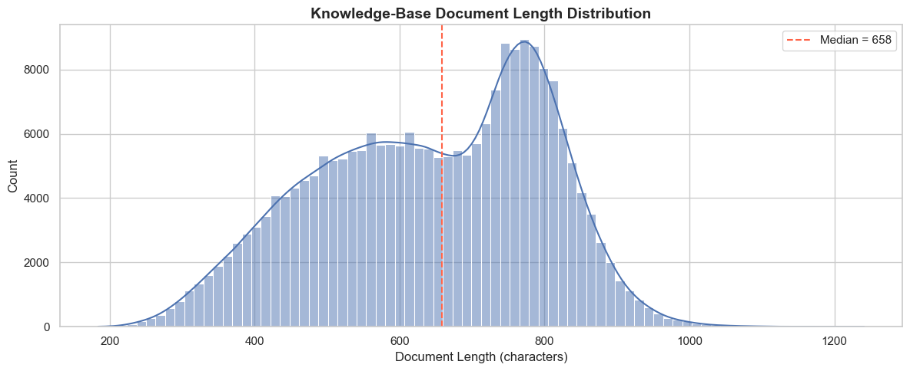

# 12 — Food Knowledge Base Creation

**Project:** GroundedNutriRec  
**Scope:** Build a structured knowledge base of food/recipe documents that can be ingested by a RAG (Retrieval-Augmented Generation) pipeline.  

## Objectives
1. Load recipe data from `RAW_recipes.csv` and interaction/review data from `RAW_interactions.csv` (archive_3 dataset).
2. Parse the `nutrition` field to extract **calories**, **total fat (% DV)**, and **protein (% DV)**.
3. Aggregate user reviews per recipe — compute **average rating** and a **representative review summary** (most-voted/longest review).
4. Construct one **text document per recipe/food item** containing:
   - Name
   - Ingredients
   - Calories, Protein, Fat
   - Prep time (minutes)
   - Rating
   - Review summary
5. Save the knowledge base as a CSV (`food_knowledge_base.csv`) and as a JSON-Lines file (`food_knowledge_base.jsonl`) for downstream vector-search ingestion.
6. Perform basic quality checks and display sample documents.

## 1. Setup and Imports


```python
import pandas as pd
import numpy as np
import ast
import json
import warnings
from pathlib import Path
from collections import defaultdict

warnings.filterwarnings('ignore')

# ── Paths ──────────────────────────────────────────────
RECIPES_PATH  = Path('dataset/archive_3/RAW_recipes.csv')
REVIEWS_PATH  = Path('dataset/archive_3/RAW_interactions.csv')
OUTPUT_DIR    = Path('dataset/archive_3')
KB_CSV_PATH   = OUTPUT_DIR / 'food_knowledge_base.csv'
KB_JSONL_PATH = OUTPUT_DIR / 'food_knowledge_base.jsonl'

print(f'Recipes source : {RECIPES_PATH}')
print(f'Reviews source : {REVIEWS_PATH}')
print(f'Output CSV     : {KB_CSV_PATH}')
print(f'Output JSONL   : {KB_JSONL_PATH}')
print('Setup complete.')
```

    Recipes source : dataset\archive_3\RAW_recipes.csv
    Reviews source : dataset\archive_3\RAW_interactions.csv
    Output CSV     : dataset\archive_3\food_knowledge_base.csv
    Output JSONL   : dataset\archive_3\food_knowledge_base.jsonl
    Setup complete.
    

## 2. Load Datasets

We load both the raw recipes and the raw user interactions (reviews + ratings).


```python
# ── Load recipes ────────────────────────────────────────
print('Loading RAW_recipes.csv...')
recipes_df = pd.read_csv(RECIPES_PATH)
print(f'  Recipes shape : {recipes_df.shape}')
print(f'  Columns       : {recipes_df.columns.tolist()}')

# ── Load interactions ────────────────────────────────────
print('\nLoading RAW_interactions.csv...')
reviews_df = pd.read_csv(REVIEWS_PATH)
print(f'  Interactions shape : {reviews_df.shape}')
print(f'  Columns            : {reviews_df.columns.tolist()}')

print('\n── Recipes preview ──')
recipes_df.head(3)
```

    Loading RAW_recipes.csv...
    

      Recipes shape : (231637, 12)
      Columns       : ['name', 'id', 'minutes', 'contributor_id', 'submitted', 'tags', 'nutrition', 'n_steps', 'steps', 'description', 'ingredients', 'n_ingredients']
    
    Loading RAW_interactions.csv...
    

      Interactions shape : (1132367, 5)
      Columns            : ['user_id', 'recipe_id', 'date', 'rating', 'review']
    
    ── Recipes preview ──
    


<div>
<style scoped>
    .dataframe tbody tr th:only-of-type {
        vertical-align: middle;
    }

    .dataframe tbody tr th {
        vertical-align: top;
    }

    .dataframe thead th {
        text-align: right;
    }
</style>
<table border="1" class="dataframe">
  <thead>
    <tr style="text-align: right;">
      <th></th>
      <th>name</th>
      <th>id</th>
      <th>minutes</th>
      <th>contributor_id</th>
      <th>submitted</th>
      <th>tags</th>
      <th>nutrition</th>
      <th>n_steps</th>
      <th>steps</th>
      <th>description</th>
      <th>ingredients</th>
      <th>n_ingredients</th>
    </tr>
  </thead>
  <tbody>
    <tr>
      <th>0</th>
      <td>arriba&nbsp;&nbsp; baked winter squash mexican style</td>
      <td>137739</td>
      <td>55</td>
      <td>47892</td>
      <td>2005-09-16</td>
      <td>['60-minutes-or-less', 'time-to-make', 'course...</td>
      <td>[51.5, 0.0, 13.0, 0.0, 2.0, 0.0, 4.0]</td>
      <td>11</td>
      <td>['make a choice and proceed with recipe', 'dep...</td>
      <td>autumn is my favorite time of year to cook! th...</td>
      <td>['winter squash', 'mexican seasoning', 'mixed ...</td>
      <td>7</td>
    </tr>
    <tr>
      <th>1</th>
      <td>a bit different&nbsp;&nbsp;breakfast pizza</td>
      <td>31490</td>
      <td>30</td>
      <td>26278</td>
      <td>2002-06-17</td>
      <td>['30-minutes-or-less', 'time-to-make', 'course...</td>
      <td>[173.4, 18.0, 0.0, 17.0, 22.0, 35.0, 1.0]</td>
      <td>9</td>
      <td>['preheat oven to 425 degrees f', 'press dough...</td>
      <td>this recipe calls for the crust to be prebaked...</td>
      <td>['prepared pizza crust', 'sausage patty', 'egg...</td>
      <td>6</td>
    </tr>
    <tr>
      <th>2</th>
      <td>all in the kitchen&nbsp;&nbsp;chili</td>
      <td>112140</td>
      <td>130</td>
      <td>196586</td>
      <td>2005-02-25</td>
      <td>['time-to-make', 'course', 'preparation', 'mai...</td>
      <td>[269.8, 22.0, 32.0, 48.0, 39.0, 27.0, 5.0]</td>
      <td>6</td>
      <td>['brown ground beef in large pot', 'add choppe...</td>
      <td>this modified version of 'mom's' chili was a h...</td>
      <td>['ground beef', 'yellow onions', 'diced tomato...</td>
      <td>13</td>
    </tr>
  </tbody>
</table>
</div>


## 3. Parse Nutrition Field

The `nutrition` column is stored as a string list:  
`[calories, total_fat_%DV, sugar_%DV, sodium_%DV, protein_%DV, sat_fat_%DV, carbs_%DV]`

We extract **calories** (index 0), **total fat %DV** (index 1), and **protein %DV** (index 4).


```python
print('Parsing nutrition field (vectorised)...')

nutrition_split = (
    recipes_df['nutrition']
    .str.strip('[]')
    .str.split(',', expand=True)
    .astype(float)
)

recipes_df['calories']      = nutrition_split[0]
recipes_df['total_fat_pdv'] = nutrition_split[1]
recipes_df['protein_pdv']   = nutrition_split[4]

print('Nutrition columns added.')
recipes_df[['name', 'calories', 'total_fat_pdv', 'protein_pdv']].head(5)
```

    Parsing nutrition field (vectorised)...
    

    Nutrition columns added.
    


<div>
<style scoped>
    .dataframe tbody tr th:only-of-type {
        vertical-align: middle;
    }

    .dataframe tbody tr th {
        vertical-align: top;
    }

    .dataframe thead th {
        text-align: right;
    }
</style>
<table border="1" class="dataframe">
  <thead>
    <tr style="text-align: right;">
      <th></th>
      <th>name</th>
      <th>calories</th>
      <th>total_fat_pdv</th>
      <th>protein_pdv</th>
    </tr>
  </thead>
  <tbody>
    <tr>
      <th>0</th>
      <td>arriba&nbsp;&nbsp; baked winter squash mexican style</td>
      <td>51.5</td>
      <td>0.0</td>
      <td>2.0</td>
    </tr>
    <tr>
      <th>1</th>
      <td>a bit different&nbsp;&nbsp;breakfast pizza</td>
      <td>173.4</td>
      <td>18.0</td>
      <td>22.0</td>
    </tr>
    <tr>
      <th>2</th>
      <td>all in the kitchen&nbsp;&nbsp;chili</td>
      <td>269.8</td>
      <td>22.0</td>
      <td>39.0</td>
    </tr>
    <tr>
      <th>3</th>
      <td>alouette&nbsp;&nbsp;potatoes</td>
      <td>368.1</td>
      <td>17.0</td>
      <td>14.0</td>
    </tr>
    <tr>
      <th>4</th>
      <td>amish&nbsp;&nbsp;tomato ketchup&nbsp;&nbsp;for canning</td>
      <td>352.9</td>
      <td>1.0</td>
      <td>3.0</td>
    </tr>
  </tbody>
</table>
</div>


## 4. Parse Ingredients

The `ingredients` column is a stringified Python list. We convert it into a clean, comma-separated string.


```python
def safe_parse_list(s):
    """Parse a stringified Python list into a real list; return empty list on failure."""
    try:
        return ast.literal_eval(s)
    except (ValueError, SyntaxError):
        return []

print('Parsing ingredients...')
recipes_df['ingredients_list'] = recipes_df['ingredients'].apply(safe_parse_list)
recipes_df['ingredients_str']  = recipes_df['ingredients_list'].apply(lambda x: ', '.join(x))

print('Done. Sample:')
recipes_df[['name', 'ingredients_str']].head(3)
```

    Parsing ingredients...
    

    Done. Sample:
    


<div>
<style scoped>
    .dataframe tbody tr th:only-of-type {
        vertical-align: middle;
    }

    .dataframe tbody tr th {
        vertical-align: top;
    }

    .dataframe thead th {
        text-align: right;
    }
</style>
<table border="1" class="dataframe">
  <thead>
    <tr style="text-align: right;">
      <th></th>
      <th>name</th>
      <th>ingredients_str</th>
    </tr>
  </thead>
  <tbody>
    <tr>
      <th>0</th>
      <td>arriba&nbsp;&nbsp; baked winter squash mexican style</td>
      <td>winter squash, mexican seasoning, mixed spice,...</td>
    </tr>
    <tr>
      <th>1</th>
      <td>a bit different&nbsp;&nbsp;breakfast pizza</td>
      <td>prepared pizza crust, sausage patty, eggs, mil...</td>
    </tr>
    <tr>
      <th>2</th>
      <td>all in the kitchen&nbsp;&nbsp;chili</td>
      <td>ground beef, yellow onions, diced tomatoes, to...</td>
    </tr>
  </tbody>
</table>
</div>


## 5. Aggregate Reviews per Recipe

For each recipe we compute:
- **avg_rating** — mean of all user ratings.
- **review_count** — total number of reviews.
- **review_summary** — the single longest review (as a proxy for the most informative one). If no review is available we use `'No reviews available.'`.


```python
print('Aggregating reviews per recipe...')

# Drop rows where review text is missing
reviews_clean = reviews_df.dropna(subset=['review']).copy()
reviews_clean['review_len'] = reviews_clean['review'].str.len()

# Average rating per recipe
rating_agg = reviews_clean.groupby('recipe_id').agg(
    avg_rating   = ('rating', 'mean'),
    review_count = ('rating', 'count')
).reset_index()

# Pick the longest review per recipe as the 'summary'
idx_longest = reviews_clean.groupby('recipe_id')['review_len'].idxmax()
longest_reviews = reviews_clean.loc[idx_longest, ['recipe_id', 'review']].rename(
    columns={'review': 'review_summary'}
)

# Merge
review_agg = rating_agg.merge(longest_reviews, on='recipe_id', how='left')

print(f'  Unique recipes with reviews: {len(review_agg):,}')
review_agg.head(3)
```

    Aggregating reviews per recipe...
    

      Unique recipes with reviews: 231,630
    


<div>
<style scoped>
    .dataframe tbody tr th:only-of-type {
        vertical-align: middle;
    }

    .dataframe tbody tr th {
        vertical-align: top;
    }

    .dataframe thead th {
        text-align: right;
    }
</style>
<table border="1" class="dataframe">
  <thead>
    <tr style="text-align: right;">
      <th></th>
      <th>recipe_id</th>
      <th>avg_rating</th>
      <th>review_count</th>
      <th>review_summary</th>
    </tr>
  </thead>
  <tbody>
    <tr>
      <th>0</th>
      <td>38</td>
      <td>4.250000</td>
      <td>4</td>
      <td>Tasty and refreshing! I love the creamy flavor...</td>
    </tr>
    <tr>
      <th>1</th>
      <td>39</td>
      <td>3.000000</td>
      <td>1</td>
      <td>I have an Indian friend who made this dish for...</td>
    </tr>
    <tr>
      <th>2</th>
      <td>40</td>
      <td>4.333333</td>
      <td>9</td>
      <td>My favourite lemonade recipe is essentially th...</td>
    </tr>
  </tbody>
</table>
</div>


## 6. Merge Recipes and Reviews

Join the aggregated review data back into the recipes DataFrame.


```python
print('Merging recipes ↔ reviews...')

kb_df = recipes_df.merge(
    review_agg,
    left_on='id',
    right_on='recipe_id',
    how='left'
)

# Fill missing review data
kb_df['avg_rating']      = kb_df['avg_rating'].fillna(0.0).round(2)
kb_df['review_count']    = kb_df['review_count'].fillna(0).astype(int)
kb_df['review_summary']  = kb_df['review_summary'].fillna('No reviews available.')

# Clean prep time
kb_df['prep_time_mins'] = kb_df['minutes'].clip(lower=0)

print(f'Knowledge-base shape: {kb_df.shape}')
kb_df[['name', 'ingredients_str', 'calories', 'protein_pdv',
       'total_fat_pdv', 'prep_time_mins', 'avg_rating', 'review_summary']].head(3)
```

    Merging recipes ↔ reviews...
    Knowledge-base shape: (231637, 22)
    


<div>
<style scoped>
    .dataframe tbody tr th:only-of-type {
        vertical-align: middle;
    }

    .dataframe tbody tr th {
        vertical-align: top;
    }

    .dataframe thead th {
        text-align: right;
    }
</style>
<table border="1" class="dataframe">
  <thead>
    <tr style="text-align: right;">
      <th></th>
      <th>name</th>
      <th>ingredients_str</th>
      <th>calories</th>
      <th>protein_pdv</th>
      <th>total_fat_pdv</th>
      <th>prep_time_mins</th>
      <th>avg_rating</th>
      <th>review_summary</th>
    </tr>
  </thead>
  <tbody>
    <tr>
      <th>0</th>
      <td>arriba&nbsp;&nbsp; baked winter squash mexican style</td>
      <td>winter squash, mexican seasoning, mixed spice,...</td>
      <td>51.5</td>
      <td>2.0</td>
      <td>0.0</td>
      <td>55</td>
      <td>5.0</td>
      <td>I used an acorn squash and recipe#137681 Swee...</td>
    </tr>
    <tr>
      <th>1</th>
      <td>a bit different&nbsp;&nbsp;breakfast pizza</td>
      <td>prepared pizza crust, sausage patty, eggs, mil...</td>
      <td>173.4</td>
      <td>22.0</td>
      <td>18.0</td>
      <td>30</td>
      <td>3.5</td>
      <td>No leftovers here. As Coleen114 mentioned this...</td>
    </tr>
    <tr>
      <th>2</th>
      <td>all in the kitchen&nbsp;&nbsp;chili</td>
      <td>ground beef, yellow onions, diced tomatoes, to...</td>
      <td>269.8</td>
      <td>39.0</td>
      <td>22.0</td>
      <td>130</td>
      <td>4.0</td>
      <td>I added black beans and corn to this and LOVED...</td>
    </tr>
  </tbody>
</table>
</div>


## 7. Construct Knowledge-Base Documents

Each document is a **single structured text string** that will later be embedded by a SentenceTransformer.  
Format:
```
Recipe: <name>
Ingredients: <comma-separated list>
Calories: <value> kcal | Protein: <value> %DV | Fat: <value> %DV
Prep Time: <value> minutes
Average Rating: <value>/5 (<count> reviews)
Review Summary: <text>
```


```python
def build_document(row):
    """Create a single knowledge-base document string from a recipe row."""
    # Truncate very long reviews to 500 chars for embedding efficiency
    review = str(row['review_summary'])[:500]
    doc = (
        f"Recipe: {row['name']}\n"
        f"Ingredients: {row['ingredients_str']}\n"
        f"Calories: {row['calories']:.1f} kcal | "
        f"Protein: {row['protein_pdv']:.1f} %DV | "
        f"Fat: {row['total_fat_pdv']:.1f} %DV\n"
        f"Prep Time: {int(row['prep_time_mins'])} minutes\n"
        f"Average Rating: {row['avg_rating']}/5 ({row['review_count']} reviews)\n"
        f"Review Summary: {review}"
    )
    return doc

print('Building document strings...')
kb_df['document'] = kb_df.apply(build_document, axis=1)
print(f'Documents created: {len(kb_df):,}')

# Show a sample document
print('\n' + '=' * 80)
print('SAMPLE DOCUMENT')
print('=' * 80)
print(kb_df['document'].iloc[0])
```

    Building document strings...
    

    Documents created: 231,637
    
    ================================================================================
    SAMPLE DOCUMENT
    ================================================================================
    Recipe: arriba   baked winter squash mexican style
    Ingredients: winter squash, mexican seasoning, mixed spice, honey, butter, olive oil, salt
    Calories: 51.5 kcal | Protein: 2.0 %DV | Fat: 0.0 %DV
    Prep Time: 55 minutes
    Average Rating: 5.0/5 (3 reviews)
    Review Summary:  I used an acorn squash and recipe#137681 Sweet Mexican spice blend. Only used 1 tsp honey & 1 tsp butter between both halves,, sprinkled the squash liberally with the spice mix. Baked covered for 45 minutes uncovered or 15.  I basted the squash   with the the butter/honey from the cavity  allowing it to get a golden color.  Lovely Squash recipe Thanks Cookgirl
    

## 8. Quality Checks

Verify the knowledge base is well-formed before saving.


```python
print('── Quality Checks ──\n')

# 1. Null documents
null_docs = kb_df['document'].isna().sum()
print(f'Null documents          : {null_docs}')

# 2. Empty documents
empty_docs = (kb_df['document'].str.strip() == '').sum()
print(f'Empty documents         : {empty_docs}')

# 3. Document length statistics
doc_lengths = kb_df['document'].str.len()
print(f'\nDocument length stats:')
print(f'  Min    : {doc_lengths.min()}')
print(f'  Median : {doc_lengths.median():.0f}')
print(f'  Mean   : {doc_lengths.mean():.0f}')
print(f'  Max    : {doc_lengths.max()}')

# 4. Duplicate recipe ids
dup_ids = kb_df['id'].duplicated().sum()
print(f'\nDuplicate recipe IDs    : {dup_ids}')

# 5. Recipes without reviews
no_reviews = (kb_df['review_count'] == 0).sum()
print(f'Recipes without reviews : {no_reviews:,} / {len(kb_df):,}')

print('\n[OK] Quality checks complete.')
```

    ── Quality Checks ──
    
    Null documents          : 0
    Empty documents         : 0
    
    Document length stats:
      Min    : 184
      Median : 658
      Mean   : 644
      Max    : 1241
    
    Duplicate recipe IDs    : 0
    Recipes without reviews : 7 / 231,637
    
    [OK] Quality checks complete.
    

## 9. Document Length Distribution


```python
import matplotlib.pyplot as plt
import seaborn as sns

sns.set_theme(style='whitegrid')
fig, ax = plt.subplots(figsize=(12, 5))

doc_lengths = kb_df['document'].str.len()
sns.histplot(doc_lengths, bins=80, kde=True, color='#4c72b0', ax=ax)
ax.set_title('Knowledge-Base Document Length Distribution', fontsize=14, fontweight='bold')
ax.set_xlabel('Document Length (characters)')
ax.set_ylabel('Count')
ax.axvline(doc_lengths.median(), color='tomato', ls='--', label=f'Median = {doc_lengths.median():.0f}')
ax.legend()
plt.tight_layout()
plt.show()
```


    

    


## 10. Save Knowledge Base

We save two formats:
1. **CSV** — for easy inspection and downstream Pandas usage.
2. **JSON-Lines** — one JSON object per line, ideal for streaming ingestion into a vector store.


```python
# Select final columns
final_cols = [
    'id', 'name', 'ingredients_str', 'calories', 'protein_pdv',
    'total_fat_pdv', 'prep_time_mins', 'avg_rating', 'review_count',
    'review_summary', 'document'
]
kb_final = kb_df[final_cols].copy()
kb_final.rename(columns={'id': 'recipe_id'}, inplace=True)

# ── Save CSV ──
kb_final.to_csv(KB_CSV_PATH, index=False)
print(f'CSV saved  -> {KB_CSV_PATH}  ({KB_CSV_PATH.stat().st_size / 1e6:.1f} MB)')

# ── Save JSONL ──
with open(KB_JSONL_PATH, 'w', encoding='utf-8') as f:
    for _, row in kb_final.iterrows():
        record = row.to_dict()
        f.write(json.dumps(record, ensure_ascii=False) + '\n')

print(f'JSONL saved -> {KB_JSONL_PATH}  ({KB_JSONL_PATH.stat().st_size / 1e6:.1f} MB)')
print(f'\nTotal documents: {len(kb_final):,}')
print('\n[OK] Knowledge base saved successfully.')
```

    CSV saved  -> dataset\archive_3\food_knowledge_base.csv  (288.5 MB)
    

    JSONL saved -> dataset\archive_3\food_knowledge_base.jsonl  (330.7 MB)
    
    Total documents: 231,637
    
    [OK] Knowledge base saved successfully.
    

## 11. Summary

| Item | Value |
|------|-------|
| Total recipes in knowledge base | `len(kb_final)` |
| Fields per document | Name, Ingredients, Calories, Protein, Fat, Prep Time, Rating, Review Summary |
| Output formats | CSV + JSON-Lines |

**Next step ->** Use the knowledge base in **Notebook 13** to build a FAISS vector store with SentenceTransformer embeddings for semantic search & RAG.
