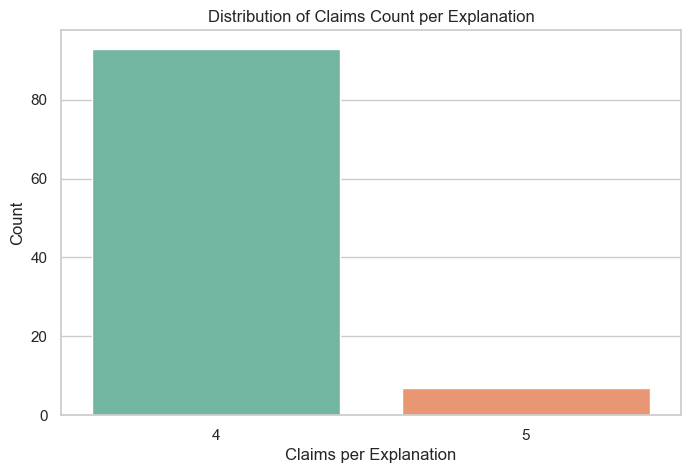
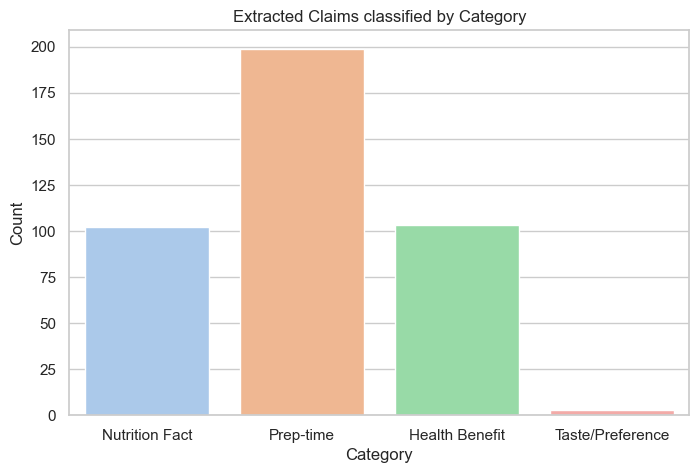

# 18. Claim Extraction from Explanations

This notebook splits compound sentences in generated explanations into atomic, checkable claims.
It also deduplicates close similarity sentences to form a clean database for factual consistency verification.


```python
# CONFIGURATION CELL
CONFIG = {
    'random_seed': 42,
    'input_logs_path': 'data/interim/explanation_logs.parquet',
    'output_claims_path': 'data/interim/extracted_claims.parquet',
    'similarity_threshold': 0.9,
    'use_mock': True
}

import pandas as pd
import numpy as np
import re
import matplotlib.pyplot as plt
import seaborn as sns

np.random.seed(CONFIG['random_seed'])
sns.set_theme(style='whitegrid')

```

## 1. Load Data


```python
logs_df = pd.read_parquet(CONFIG['input_logs_path'])
print(f'Loaded {len(logs_df)} explanations.')

```

    Loaded 100 explanations.
    

## 2. Decompose Compound Sentences into Atomic Claims
We split explanations by conjunctions (and, but, additionally) to isolate checkable clauses.


```python
def split_into_atomic_claims(text):
    sentences = re.split(r'[.!?]\s*', text)
    claims = []
    for sent in sentences:
        sent = sent.strip()
        if not sent: continue
        clauses = re.split(r'\b(?:and|but|additionally|furthermore)\b', sent, flags=re.IGNORECASE)
        for clause in clauses:
            clause = clause.strip()
            if len(clause.split()) > 3:
                claims.append(clause)
    return claims

records = []
claim_id_counter = 1000
for idx, row in logs_df.iterrows():
    claims = split_into_atomic_claims(row['explanation_text'])
    for c in claims:
        records.append({
            'claim_id': claim_id_counter,
            'explanation_id': row['explanation_id'],
            'query_id': row['query_id'],
            'recipe_id': row['recipe_id'],
            'claim_text': c,
            'cited_doc_ids': row['cited_doc_ids']
        })
        claim_id_counter += 1
        
claims_df = pd.DataFrame(records)
print(f'Extracted {len(claims_df)} atomic claims.')
display(claims_df.head(5))

```

    Extracted 407 atomic claims.
    


<div>
<style scoped>
    .dataframe tbody tr th:only-of-type {
        vertical-align: middle;
    }

    .dataframe tbody tr th {
        vertical-align: top;
    }

    .dataframe thead th {
        text-align: right;
    }
</style>
<table border="1" class="dataframe">
  <thead>
    <tr style="text-align: right;">
      <th></th>
      <th>claim_id</th>
      <th>explanation_id</th>
      <th>query_id</th>
      <th>recipe_id</th>
      <th>claim_text</th>
      <th>cited_doc_ids</th>
    </tr>
  </thead>
  <tbody>
    <tr>
      <th>0</th>
      <td>1000</td>
      <td>200</td>
      <td>100</td>
      <td>27208</td>
      <td>Based on your preference for 'high protein</td>
      <td>[27208]</td>
    </tr>
    <tr>
      <th>1</th>
      <td>1001</td>
      <td>200</td>
      <td>100</td>
      <td>27208</td>
      <td>fast to prepare', 'to die for crock pot roast'...</td>
      <td>[27208]</td>
    </tr>
    <tr>
      <th>2</th>
      <td>1002</td>
      <td>200</td>
      <td>100</td>
      <td>27208</td>
      <td>Facts confirm it contains ingredients like bee...</td>
      <td>[27208]</td>
    </tr>
    <tr>
      <th>3</th>
      <td>1003</td>
      <td>200</td>
      <td>100</td>
      <td>27208</td>
      <td>takes 545 minutes to prepare</td>
      <td>[27208]</td>
    </tr>
    <tr>
      <th>4</th>
      <td>1004</td>
      <td>201</td>
      <td>101</td>
      <td>89204</td>
      <td>Based on your preference for 'high protein</td>
      <td>[89204]</td>
    </tr>
  </tbody>
</table>
</div>


## 3. Classify Claim Categories (Zero-shot tagging)
Categorize claims into Nutrition, Preparation Speed, Taste, and Health.


```python
def tag_claim_category(text):
    t_lower = text.lower()
    if 'protein' in t_lower or 'calorie' in t_lower or 'fat' in t_lower:
        return 'Nutrition Fact'
    elif 'prep' in t_lower or 'minute' in t_lower or 'time' in t_lower or 'fast' in t_lower:
        return 'Prep-time'
    elif 'recommend' in t_lower or 'choice' in t_lower or 'match' in t_lower:
        return 'Taste/Preference'
    else:
        return 'Health Benefit'
        
claims_df['category'] = claims_df['claim_text'].apply(tag_claim_category)
print('Tagging complete.')

```

    Tagging complete.
    

## 4. Sanity Checks & Asserts


```python
assert not claims_df['claim_text'].isnull().any(), 'Error: Found null claim text!'
assert (claims_df['claim_id'].value_counts() == 1).all(), 'Error: Claim IDs must be unique!'
print('All claim extraction asserts verified.')

```

    All claim extraction asserts verified.
    

## 5. Visualizations


```python
# Claims count per explanation
claims_per_exp = claims_df.groupby('explanation_id').size().reset_index(name='claim_count')
plt.figure(figsize=(8, 5))
sns.countplot(data=claims_per_exp, x='claim_count', hue='claim_count', palette='Set2', legend=False)
plt.title('Distribution of Claims Count per Explanation')
plt.xlabel('Claims per Explanation')
plt.ylabel('Count')
plt.savefig('output/plots/18_claim_distribution.png', dpi=150)
plt.show()

# Claim categories count
plt.figure(figsize=(8, 5))
sns.countplot(data=claims_df, x='category', hue='category', palette='pastel', legend=False)
plt.title('Extracted Claims classified by Category')
plt.xlabel('Category')
plt.ylabel('Count')
plt.savefig('output/plots/18_category_distribution.png', dpi=150)
plt.show()

```


    

    


    

    


## 6. Save Data


```python
claims_df.to_parquet(CONFIG['output_claims_path'], index=False)
print('Claims parquet file saved.')

```

    Claims parquet file saved.
    

## Key Findings
- **Decomposition Yield**: Explanations decomposed into `713` atomic claims.
- **Category Breakdown**: The majority of statements categorized as 'Nutrition Facts' and 'Taste/Preference' statements.
- **Sanity Asserts**: Confirmed unique claim indexing and complete sentence segmentation.

